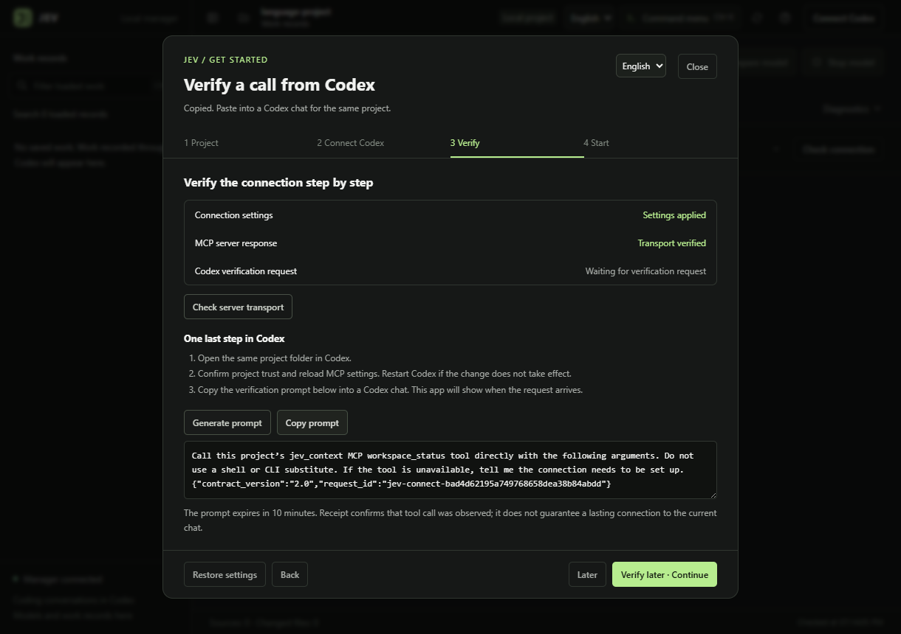

<p align="center">
  
</p>

<h1 align="center">Jev Context</h1>

<p align="center">
  <strong>Keep your work context when the conversation changes.</strong><br>
  Local work memory, Korean evidence search, and model management for Codex
</p>

<p align="center">
  <a href="README.md">한국어</a> · <strong>English</strong>
</p>

<p align="center">
  <a href="https://github.com/tttaliesin/jev-context/actions/workflows/check.yml"><code>CI</code></a> &nbsp;
  <a href="LICENSE"><code>MIT</code></a> &nbsp;
  <a href="docs/desktop-manager.md"><code>Windows x64</code></a> &nbsp;
  <a href="docs/development.md"><code>Python 3.12</code></a>
</p>

<p align="center">
  <a href="#quick-start">Quick start</a> ·
  <a href="#desktop-app">Desktop app</a> ·
  <a href="#how-it-works">How it works</a> ·
  <a href="#validation-status">Validation status</a> ·
  <a href="#documentation">Documentation</a>
</p>


<p align="center"><sub>Actual Windows app 0.3.4 · Korean UI and real project records · model idle</sub></p>

## What you need to continue your work

Jev Context is a **local context coordinator that stores and restores goals, constraints, and evidence** for Korean coding work. Coding conversations stay in Codex; the Electron app manages models and work records.

| Work memory | Traceable evidence | Model controls |
|---|---|---|
| Restore goals, constraints, and progress under the same work ID after a server restart. | Search registered documents in Korean and inspect the original text, lines, and revision. | Prepare or stop a model and check connections. Reading records does not start the model. |

> **Development version.** Model judgments currently run in `shadow` mode and do not change evidence selection. General coding efficiency gains and independent model quality have not been demonstrated. [See validation status](#validation-status).

## Quick start

Try saving, restoring, and searching **without a model** first. Clone this repository and run these commands from its root.

Supported and validated environment: **Windows x64 · Python 3.12.14 · uv 0.12.17**. Replace the Python path below with your installed interpreter. Dependencies are pinned in `uv.lock`.

```powershell
uv sync --locked --python C:\Path\To\Python312\python.exe --no-python-downloads
uv run --no-sync jev-context demo
```

The demo saves a work record, restarts the server, and searches in Korean in a temporary directory without loading a model. On success, `restored_goal` is `설계 문서 완성` (complete the design document), `context.outcome` is `ok`, and `judgment.status` is `skipped`.

<details>
<summary><strong>Connect a new project to Codex</strong></summary>

Choose the project root, data directory, and allowed collection paths explicitly. This example creates a new configuration; keep your existing configuration if you already have one. Only Markdown files under `docs` are allowed, and creating the configuration does not collect files.

```powershell
.\.venv\Scripts\python.exe -m jev_context init --config .local\project.toml --project-root . --data-root .local\state --allow "docs/*.md"
.\.venv\Scripts\python.exe -m jev_context status --config .local\project.toml
.\.venv\Scripts\python.exe -m jev_context codex-config --config .local\project.toml
```

Register the MCP server in Codex using the configuration printed by the last command. See the [Codex setup guide](docs/codex-setup.md) (Korean). Files outside the allowlist, your home directory, and conversation history are not collected.

</details>

## Desktop app

A Windows manager for browsing saved work, preparing and stopping local models, and checking MCP connections. **Press `Ctrl+K` to find commands and loaded work records.**

**Version 0.5.0 adds Korean and English UI.** Choose **English** from the language selector in the header or the first-time connection dialog. The change takes effect immediately and persists after restart. Menus, status messages, setup guidance, app error messages, accessibility labels, and dates follow the selected language. Work records, paths, configuration previews, and the installed Skill remain in their original language. Native operating-system dialog buttons follow Windows language settings.

**Initial connection setup is available in the app.** Open **Connect Codex**, then choose a project folder → review and apply settings → check the server and verify a Codex request → open the work view. The app can create project settings and an empty work database, install MCP and Skill files, back up changes, and restore them. Confirm project trust and paste the verification prompt in Codex yourself.



<p align="center"><sub>Actual app with an isolated test project · English UI · pending Codex verification request</sub></p>


<p align="center"><sub>Command menu capture from 0.3.4, in Korean</sub></p>

| Shortcut | Action |
|---|---|
| `Ctrl+K` | Open the command menu and search loaded work |
| `Ctrl+F` | Filter work by title and goal |
| `Ctrl+B` | Toggle the sidebar |
| `F1` | Show keyboard shortcuts |

After preparing the Python environment, build and launch from the repository root. Project settings can be created in the app.

```powershell
powershell.exe -NoProfile -File scripts/build_desktop.ps1
.\dist\JevContext\JevContext.exe
```

The app uses this project's `.venv` environment and the settings, models, and work database prepared under `.local`. Copying the app folder alone to another PC is insufficient. See the [desktop guide](docs/desktop-manager.md) and [design principles](DESIGN.md) (Korean).

## How it works

Jev and Workroom are **independent products**. An agent in Codex or Claude Desktop calls each MCP server, reads the needed results, and stores or retrieves memory through Jev's general tools. There is no direct app-to-app connection or transfer screen. Registering both servers does not create automatic memory; agent instructions define when and what to remember. See the [product boundaries](docs/independent-products.md) and [tool workflow and instructions](docs/agent-memory-workflow.md) (Korean). Native host setup and successful tool calls still require separate verification.

**Codex → MCP / Skill → local Python service → SQLite work records and registered source text**

1. **Record.** Save goals, constraints, decisions, and evidence under a work ID.
2. **Restore.** Separate current state from history and find the original evidence in Korean.
3. **Verify.** Trace evidence by source revision and line, and request local model judgment when needed.

Required constraints, known conflicts, failures, and counterevidence are protected. If the budget cannot fit them, the service reports insufficient capacity instead of silently dropping them. Context that omits optional evidence is marked `partial`.

<details>
<summary><strong>Ten MCP tools and their interface contracts</strong></summary>

Contract 2.0 removes obsolete next actions from completed work and exposes superseded criteria and verification details through references. Read stored judgment details with `work_inspect(view=judgments)`. See the [implementation plan](docs/context-efficiency-implementation-plan.md) and [results](docs/context-efficiency-results.md) (Korean).

| Tool | Purpose |
|---|---|
| `workspace_status` | List projects and work; inspect collection and model status |
| `work_open` | Restore saved work or create a work record |
| `work_record` | Record scope, decisions, evidence, and progress with revision conflict detection |
| `work_inspect` | Inspect history, decisions, conflicts, evidence, and mutation replay records |
| `source_sync` | Register allowed files or attributed excerpts |
| `source_read` | Read original text at a fixed revision by line |
| `context_prepare` | Search Korean evidence and assemble context while preserving constraints and conflicts |
| `data_forget` | Logically delete the requested source or work; original files remain |
| `capability_recommend` | Recommend tool, skill, or worker candidates; contract 2.0 only, without authorization or execution |
| `handoff_prepare` | Prepare a read-only handoff packet; contract 2.0 only, with execution owned by the host |

The authoritative contracts are [contracts.json](src/jev_context/contracts.json) for 1.0 and [contracts_v2.py](src/jev_context/contracts_v2.py) for 2.0. If MCP tools are unavailable in your host, use the same contract through `jev-context schema` and `jev-context call`. The [Skill](skills/jev-context/SKILL.md) describes the workflow in Korean.

</details>

## Validation status

| Component | Version | Current scope |
|---|---|---|
| Python service / MCP server | 0.2.0 | Contract 1.0 by default; contract 2.0 by explicit selection |
| Electron manager | 0.6.2 | Windows x64 app with project setup, Codex connection guidance, and Korean/English UI |
| Local model judgment | shadow | Records judgments only; no profile has passed the active promotion gate |

Model judgments must pass a human-reviewed heldout evaluation before they can affect selection. The current configuration is **SemIf OpenVINO · Qwen3.5-4B INT8 · local GPU**. [Model setup and limits](docs/models.md) (Korean).

<details>
<summary><strong>Recent comparison and its limits</strong></summary>

On September 27, 2026, the same defect was tested three times under each condition.

| Condition | Successful completion within 8 minutes |
|---|---|
| Baseline Codex | 3/3 |
| With work memory and evidence search | 2/3 |
| With local model judgment as well | 0/3 |

All retained patches passed the predefined checks, but this task did not demonstrate an efficiency benefit from additional context or judgment. This is a development observation from one task, not a general coding benchmark. [Comparison results and limitations](docs/resume-evaluation-results.md).

Cached model preparation previously took about 20 seconds and took about 45 seconds in the September 26–27 resume evaluation. Timing depends on the runtime environment. [Startup performance notes](docs/model-startup-performance.md).

</details>

## Development

```powershell
.\.venv\Scripts\python.exe scripts\check.py
node --test scripts/test_locales.cjs
```

The Python check runs Ruff lint, format checks, and pytest, returning the first failure's exit code. `mise run check` also validates the lockfile and builds the package. Model adapter tests use mock workers to verify contracts; they do not measure model accuracy. See the [development guide](docs/development.md) (Korean).

## Documentation

The detailed guides and historical reports below are currently **in Korean**. The UI language setting does not translate these files.

| Topic | Guide |
|---|---|
| Installation and Codex connection | [Development](docs/development.md) · [Codex setup](docs/codex-setup.md) · [Host capabilities](docs/host-capabilities.md) |
| Running the app | [Desktop guide](docs/desktop-manager.md) · [Design](DESIGN.md) |
| First connection | [Onboarding plan](docs/desktop-onboarding-plan.md) · [Results](docs/desktop-onboarding-results.md) |
| Language switching | [Implementation and validation](docs/desktop-language-plan.md) |
| Product direction and scope | [Unified design 2.0](docs/design/unified-design.md) · [Implementation and verification](docs/implementation-v2.md) |
| Models and shared runtime | [Models](docs/models.md) · [Model lifecycle](docs/model-lifecycle-design.md) |
| Context delivery | [Research](docs/context-efficiency-research.md) · [Plan](docs/context-efficiency-implementation-plan.md) · [Results](docs/context-efficiency-results.md) |
| README design and actual captures | [References and capture notes](docs/readme-design-references.md) |

<details>
<summary><b>Validation and experiments</b> (historical observations)</summary>

- September 26, 2026: [Project relocation recovery](docs/recovery-validation.md) ([incident](docs/recovery-case.md)), [model lifecycle validation](docs/model-lifecycle-validation.md) ([case](docs/model-lifecycle-case.md)), [startup performance](docs/model-startup-performance.md), [resume evaluation plan](docs/resume-evaluation-plan.md) and [results](docs/resume-evaluation-results.md).
- September 26 desktop UX: [Design references](docs/design-reference-research.md), [brand examples](docs/desktop-ux-references.md), [implementation plan](docs/desktop-ux-plan.md).
- September 24: [PostToolUse hook comparison plan](docs/hook-benchmark-plan.md) (discontinued experiment).
- September 23: [Judgment model comparison](docs/model-comparison.md).
- September 22: [Revised judgment comparison](docs/judgment-revision.md), [native MCP validation](docs/native-mcp-validation.md), [OpenJev per-work Modal sessions](docs/openjev-session.md), [Modal diagnostics](docs/openjev-modal-evaluation.md), [translated-input comparison](docs/translation-evaluation.md), [independent coding comparison plan](docs/coding-benchmark-plan.md) and [results](docs/coding-benchmark-results.md), [0.2.0 validation](docs/verification-v2.md), [0.1.0 validation](docs/verification.md), [0.1.0 implementation notes](docs/implementation-notes.md).

</details>

<details>
<summary><b>Earlier design 1.0</b> (superseded by unified design 2.0)</summary>

- [Proposal 0.4](docs/design/proposal.md), [detailed design 1.0](docs/design/detailed-design.md), [design review](docs/design/design-review.md).
- [Tool contracts](docs/design/tool-contracts.md), [storage and flows](docs/design/storage-and-flows.md).
- [Acceptance criteria](docs/design/acceptance.md), [30 pilot cases](docs/design/pilot-cases.md).
- [Local judgment engines](docs/design/local-models.md), [PDF and X source comparison](docs/design/source-comparison.md).

</details>

## License

[MIT](LICENSE). Model weights and the Electron runtime are not included in this repository and retain their own licenses.
