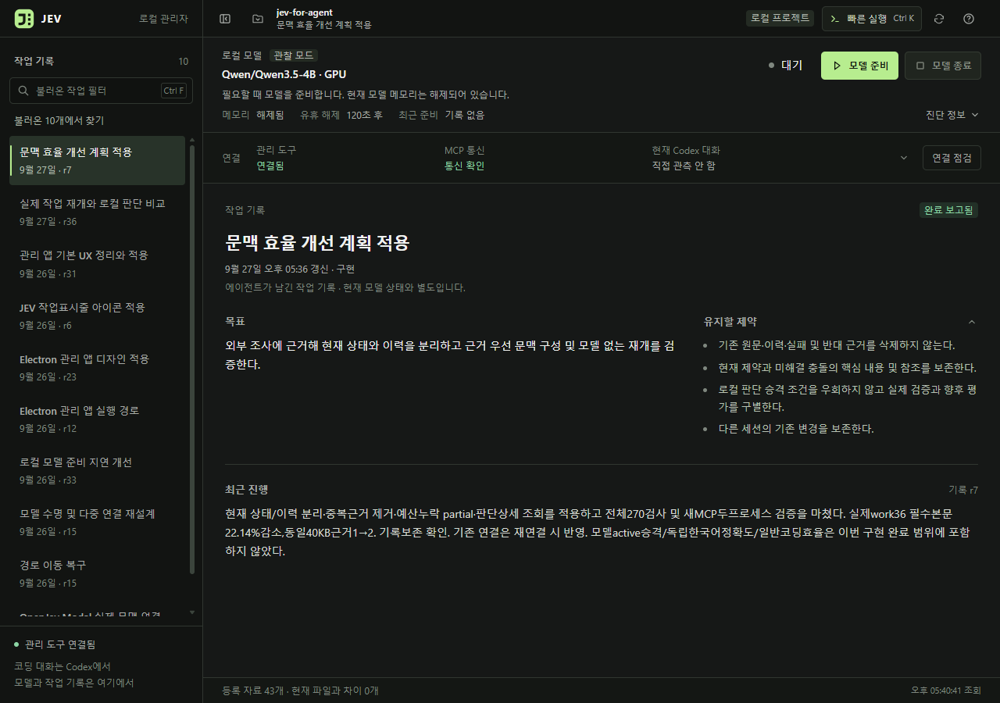
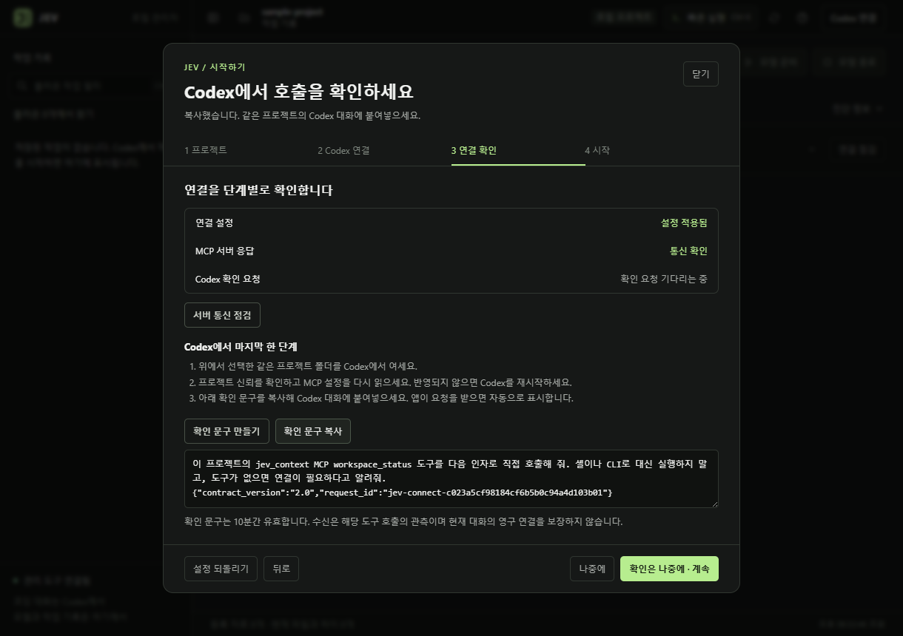
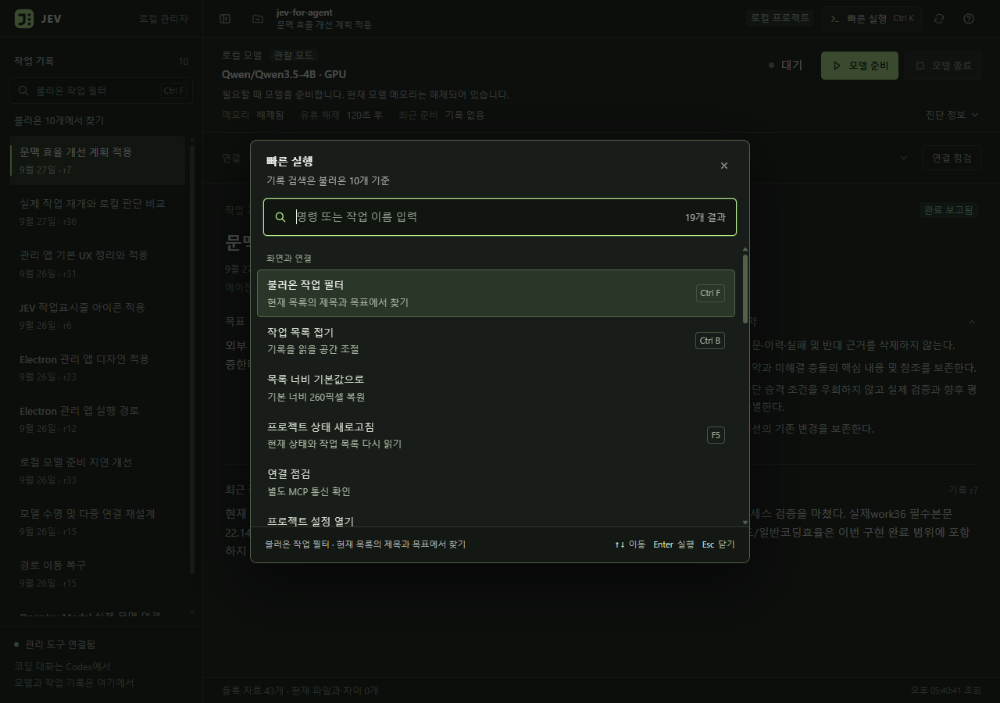

<p align="center">
  
</p>

<h1 align="center">Jev Context</h1>

<p align="center"><strong>한국어</strong> · <a href="README.en.md">English</a></p>

<p align="center">
  <strong>대화가 바뀌어도, 작업의 맥락은 이어지도록.</strong><br>
  Codex를 위한 로컬 작업 기억 · 한국어 근거 검색 · 모델 관리
</p>

<p align="center">
  <a href="https://github.com/tttaliesin/jev-context/actions/workflows/check.yml"><code>CI</code></a> &nbsp;
  <a href="LICENSE"><code>MIT</code></a> &nbsp;
  <a href="docs/desktop-manager.md"><code>Windows x64</code></a> &nbsp;
  <a href="docs/development.md"><code>Python 3.12</code></a>
</p>

<p align="center">
  <a href="#빠른-시작">빠른 시작</a> ·
  <a href="#데스크톱-앱">데스크톱 앱</a> ·
  <a href="#동작-방식">동작 방식</a> ·
  <a href="#검증-현황">검증 현황</a> ·
  <a href="#문서">문서</a>
</p>



<p align="center"><sub>Windows에서 실행한 데스크톱 앱 0.3.4 · 실제 프로젝트 기록 · 모델 대기 상태</sub></p>

## 작업을 이어 가는 데 필요한 것들

Jev Context는 한국어 코딩 작업의 **목표·제약·근거를 저장하고 다시 꺼내는 로컬 문맥 조정기**입니다. 코딩 대화는 Codex에서, 모델과 작업 기록 관리는 Electron 앱에서 합니다.

| 작업 기억 | 원문이 있는 근거 | 직접 관리하는 모델 |
|---|---|---|
| 서버를 다시 시작해도 같은 작업 ID로 목표·제약·진행 내용을 복원합니다. | 등록한 문서를 한국어로 검색하고 원문·행 위치·revision을 함께 확인합니다. | 앱에서 준비·종료와 연결 상태를 확인합니다. 기록을 읽는 것만으로 모델을 시작하지 않습니다. |

**0.7.0 문제 해결:** 연결 영역에서 앱을 다시 연결하고 진단 요약을 미리 본 뒤 복사할 수 있습니다. 반복 조회 실패는 대기 간격을 늘리며, 창으로 돌아오면 상태를 재확인합니다. [사례 조사·적용·검증](docs/desktop-operations-research.md)

**0.8.0 기억 복원 확인:** 연결 상세에서 서버 코드 변경 여부와 마지막 MCP 문맥 응답을 확인합니다. 복원 revision과 현재 기록을 구분하며 호스트 수신·답변 반영은 미확인으로 표시합니다. [적용 계획](docs/agent-memory-implementation-plan.md) · [검증 결과](docs/agent-memory-implementation-results.md)

> **개발 버전입니다.** 모델 판단은 현재 `shadow` 모드로 기록되며 근거 선택을 바꾸지 않습니다. 일반 코딩 효율 개선과 모델의 독립 품질은 아직 입증하지 못했습니다. [검증 현황 보기](#검증-현황)

## 빠른 시작

먼저 **모델 없이** 저장·복원·검색 흐름을 실행해 보세요. 저장소를 받은 뒤 프로젝트 루트에서 실행합니다.

지원·검증 환경: **Windows x64 · Python 3.12.14 · uv 0.12.17**. 아래 Python 경로는 설치된 실행기 경로로 바꿉니다. 의존성은 `uv.lock`으로 고정돼 있습니다.

```powershell
uv sync --locked --python C:\Path\To\Python312\python.exe --no-python-downloads
uv run --no-sync jev-context demo
```

`demo`는 모델 없이 임시 폴더에서 작업 저장 → 서버 재시작 → 한국어 검색을 실행합니다. 성공하면 `restored_goal`이 `설계 문서 완성`, `context.outcome`이 `ok`, `judgment.status`가 `skipped`입니다.

<details>
<summary><strong>새 프로젝트를 Codex에 연결하기</strong></summary>

프로젝트 루트, 저장 위치, 수집을 허용할 경로를 직접 지정합니다. 아래 예시는 새 설정을 만드는 경우이며, 기존 설정이 있으면 그대로 사용합니다. `docs`의 Markdown만 허용하며 설정 생성 자체는 파일을 수집하지 않습니다.

```powershell
.\.venv\Scripts\python.exe -m jev_context init --config .local\project.toml --project-root . --data-root .local\state --allow "docs/*.md"
.\.venv\Scripts\python.exe -m jev_context status --config .local\project.toml
.\.venv\Scripts\python.exe -m jev_context codex-config --config .local\project.toml
```

마지막 명령이 출력한 설정으로 Codex에 MCP 서버를 등록합니다. 절차는 [Codex 연결 안내](docs/codex-setup.md)에 있습니다. 허용 경로에 없는 파일, 홈 디렉터리, 대화 이력은 수집하지 않습니다.

</details>

## 데스크톱 앱

작업 기록을 둘러보고, 로컬 모델을 준비·종료하고, MCP 연결을 점검하는 Windows 관리 앱입니다. **`Ctrl+K`로 명령과 불러온 작업을 빠르게 찾을 수 있습니다.**

**0.5.0부터 한국어 / English 전환을 지원합니다.** 상단과 첫 연결 창의 언어 선택에서 바로 변경할 수 있으며 재실행 후에도 유지됩니다. 메뉴·상태·연결 안내·앱 오류·날짜 표시에 적용하고, 작업 원문·경로·설정 미리보기·설치할 Skill은 유지합니다. 운영체제 대화상자의 기본 버튼은 Windows 언어 설정을 따릅니다. [구현·검증 기록](docs/desktop-language-plan.md)

**0.4.0부터 첫 연결도 앱에서 진행합니다.** 상단 **Codex 연결**을 열고 프로젝트 폴더 선택 → 설정 미리보기·적용 → 서버 점검·Codex 확인 → 작업 화면 순서로 진행하세요. 새 프로젝트 설정과 빈 작업 DB, MCP·Skill 설치, 백업·되돌리기를 지원합니다. Codex의 프로젝트 신뢰 확인과 확인 문구 전달은 Codex에서 직접 합니다.



<p align="center"><sub>실제 앱의 새 프로젝트 검증 화면 · 서버 통신 확인 · Codex 확인 요청 대기</sub></p>



| 단축키 | 기능 |
|---|---|
| `Ctrl+K` | 빠른 실행: 명령과 불러온 작업 찾기 |
| `Ctrl+F` | 작업 목록의 제목·목표 필터 |
| `Ctrl+B` | 사이드바 접기·펼치기 |
| `F1` | 단축키 안내 |

Python 환경을 준비한 뒤, 프로젝트 루트에서 빌드하고 실행합니다. 프로젝트 설정은 앱에서 만들 수 있습니다.

```powershell
powershell.exe -NoProfile -File scripts/build_desktop.ps1
.\dist\JevContext\JevContext.exe
```

앱은 이 프로젝트의 `.venv`와 `.local`에 준비된 설정·모델·작업 DB를 사용합니다. 앱 폴더만 다른 PC로 복사해서는 실행되지 않습니다. 설치와 연결 점검의 범위는 [데스크톱 앱 안내](docs/desktop-manager.md), 화면 구성 원칙은 [DESIGN.md](DESIGN.md)에 있습니다.

## 동작 방식

Jev와 Workroom은 **독립 제품**입니다. Codex·Claude Desktop의 에이전트가 각 MCP를 호출해 필요한 결과를 읽고 Jev의 일반 기억 도구로 저장·검색합니다. 앱 간 직접 연결·전송 화면은 제공하지 않습니다. 두 서버를 등록하는 것만으로 자동 기억되지는 않으며 저장 시점과 범위는 에이전트 지침으로 정합니다. [독립 제품 원칙](docs/independent-products.md) · [도구 사용과 지침](docs/agent-memory-workflow.md)

**Codex → MCP / Skill → 로컬 Python 서비스 → SQLite 작업 기록과 등록 원문**

1. **기록합니다.** 목표·제약·결정·근거를 작업 ID에 묶어 저장합니다.
2. **복원합니다.** 현재 상태와 과거 이력을 구분하고, 필요한 원문을 한국어로 찾습니다.
3. **확인합니다.** 원문의 revision과 행 위치로 근거를 추적하고, 필요한 경우 로컬 모델 판단을 요청합니다.

필수 제약, 알려진 충돌, 실패와 반대 근거를 보호합니다. 예산이 부족하면 이를 조용히 버리지 않고 부족 상태를 반환합니다. 선택적 근거가 빠진 문맥은 `partial`로 표시합니다.

<details>
<summary><strong>MCP 도구 10개와 인터페이스 계약</strong></summary>

계약 2.0은 완료된 작업의 오래된 다음 행동을 제거하고, 대체된 기준·검증 상세는 참조로 제공합니다. 저장된 판단 상세는 `work_inspect(view=judgments)`로 읽습니다. [적용 계획](docs/context-efficiency-implementation-plan.md)과 [검증 결과](docs/context-efficiency-results.md)를 참고하세요.

| 도구 | 하는 일 |
|---|---|
| `workspace_status` | 프로젝트와 작업 목록, 수집 및 모델 상태 조회 |
| `work_open` | 저장한 작업 복원 또는 새 작업 생성 |
| `work_record` | 목표 범위·결정·근거·진행 기록 (revision 충돌 감지) |
| `work_inspect` | 작업의 이력·결정·충돌·근거·중복 요청 기록 조회 |
| `source_sync` | 허용된 파일 또는 출처가 있는 발췌 등록 |
| `source_read` | 고정 revision의 원문을 행 단위로 조회 |
| `context_prepare` | 한국어 근거 검색과 제약·충돌을 보존하는 문맥 구성 |
| `data_forget` | 요청한 source 또는 work를 논리 삭제 (원본 파일은 유지) |
| `capability_recommend` | 도구·스킬·worker 후보 추천, 계약 2.0 전용. 권한 부여나 실행은 하지 않음 |
| `handoff_prepare` | 읽기 작업 전달 묶음 준비, 계약 2.0 전용. 실행은 호스트가 담당 |

입력·출력 계약은 [contracts.json](src/jev_context/contracts.json)(1.0)과 [contracts_v2.py](src/jev_context/contracts_v2.py)(2.0)가 기준입니다. MCP가 노출되지 않은 환경에서는 같은 계약을 CLI로 호출할 수 있습니다 (`jev-context schema`, `jev-context call`). 사용 흐름은 [Skill](skills/jev-context/SKILL.md)에 정리돼 있습니다.

</details>

## 검증 현황

| 구성 요소 | 버전 | 현재 범위 |
|---|---|---|
| Python 서비스 · MCP 서버 | 0.2.0 | 계약 1.0 기본 제공, 계약 2.0 명시 선택 |
| Electron 관리 앱 | 0.8.0 | 프로젝트 준비·Codex 연결 안내·한국어/영어 전환·문맥 응답 관측을 포함한 Windows x64 앱 |
| 로컬 모델 판단 | shadow | 판단 기록만 수행. active 승격 평가를 통과한 프로필 없음 |

모델 판단을 선택에 반영하려면 사람이 검토한 heldout 평가를 통과해야 합니다. 현재 구성은 **SemIf OpenVINO · Qwen3.5-4B INT8 · 로컬 GPU**입니다. [모델 준비와 제한](docs/models.md)

<details>
<summary><strong>최근 비교 결과와 해석 범위</strong></summary>

2026-09-27 동일 결함을 세 조건에서 각각 세 번 실행했습니다.

| 조건 | 8분 내 정상 완료 |
|---|---|
| 기본 Codex | 3/3 |
| 작업 저장·근거 검색 추가 | 2/3 |
| 로컬 모델 판단까지 추가 | 0/3 |

남긴 수정본은 모두 정해 둔 검사를 통과했지만, 이번 과제에서 문맥·판단 추가의 효율상 이점은 확인하지 못했습니다. 단일 과제의 개발 관측이며 일반 코딩 성능을 대표하지 않습니다. [비교 결과와 한계](docs/resume-evaluation-results.md)

캐시를 사용한 모델 준비 시간은 이전 약 20초, 9월 26~27일 재개 검증에서는 약 45초였으며 실행 환경에 따라 달라집니다. [시작 지연 개선 기록](docs/model-startup-performance.md)

</details>

## 개발

```powershell
.\.venv\Scripts\python.exe scripts\check.py
```

Ruff lint·format 검사와 pytest를 순서대로 실행하고 첫 실패의 종료 코드를 돌려줍니다. `mise run check`는 여기에 lock 확인과 build를 더합니다. 모델 어댑터 테스트는 모의 worker로 계약을 검사하며 모델 정확도와는 별개입니다. 환경 구성은 [개발 환경](docs/development.md)에 있습니다.

## 문서

| 알아보고 싶은 것 | 안내 |
|---|---|
| 설치와 Codex 연결 | [개발 환경](docs/development.md) · [Codex 연결](docs/codex-setup.md) · [호스트 기능표](docs/host-capabilities.md) |
| 앱 실행과 조작 | [데스크톱 앱 안내](docs/desktop-manager.md) · [디자인 기준](DESIGN.md) |
| 처음 연결하기 | [온보딩 적용 계획](docs/desktop-onboarding-plan.md) · [검증 결과](docs/desktop-onboarding-results.md) |
| 제품 방향과 구현 범위 | [통합 설계 2.0](docs/design/unified-design.md) · [구현과 검증](docs/implementation-v2.md) |
| 유사 목적 제품 비교와 보완 우선순위 | [에이전트 기억 제품 연구](docs/agent-memory-competitive-research.md) · [운영 경험 연구](docs/desktop-operations-research.md) |
| 모델 준비와 공유 실행기 | [모델 안내](docs/models.md) · [모델 수명 설계](docs/model-lifecycle-design.md) |
| 문맥 전달 개선 | [외부 조사](docs/context-efficiency-research.md) · [적용 계획](docs/context-efficiency-implementation-plan.md) · [검증 결과](docs/context-efficiency-results.md) |
| README 구성과 실제 화면 캡처 | [레퍼런스와 촬영 기록](docs/readme-design-references.md) |

<details>
<summary><b>검증·실험 기록</b> (날짜별, 작성 당시 기준)</summary>

- 2026-09-26: [프로젝트 이동 복구와 실사용 검증](docs/recovery-validation.md) ([장애 기록](docs/recovery-case.md)), [모델 수명 적용 검증](docs/model-lifecycle-validation.md) ([원문](docs/model-lifecycle-case.md)), [모델 시작 지연 개선](docs/model-startup-performance.md), [작업 재개 비교 계획](docs/resume-evaluation-plan.md)·[결과](docs/resume-evaluation-results.md)
- 2026-09-26 데스크톱 UX: [디자인 레퍼런스 조사](docs/design-reference-research.md), [브랜드 사례 조사](docs/desktop-ux-references.md), [재적용 계획](docs/desktop-ux-plan.md)
- 2026-09-24: [PostToolUse hook 비교 계획](docs/hook-benchmark-plan.md) (중단된 실험)
- 2026-09-23: [판단 모델 비교 진단](docs/model-comparison.md)
- 2026-09-22: [판단 개선 후 비교](docs/judgment-revision.md), [현재 대화의 MCP 연결 검증](docs/native-mcp-validation.md), [OpenJev 작업별 Modal 연결](docs/openjev-session.md), [OpenJev Modal 진단](docs/openjev-modal-evaluation.md), [영어 번역 입력 비교](docs/translation-evaluation.md), [독립 코드 수정 비교 계획](docs/coding-benchmark-plan.md)·[결과](docs/coding-benchmark-results.md), [0.2.0 검증 기록](docs/verification-v2.md), [0.1.0 검증 기록](docs/verification.md), [0.1.0 설계 보완](docs/implementation-notes.md)

</details>

<details>
<summary><b>이전 설계 1.0</b> (통합 설계 2.0으로 대체됨)</summary>

- [설계안 0.4](docs/design/proposal.md), [상세 설계 1.0](docs/design/detailed-design.md), [설계 검토](docs/design/design-review.md)
- [도구 인터페이스 계약](docs/design/tool-contracts.md), [저장 구조와 처리 순서](docs/design/storage-and-flows.md)
- [검증 설계와 합격 기준](docs/design/acceptance.md), [평가 사례 30개](docs/design/pilot-cases.md)
- [로컬 판단 엔진 비교](docs/design/local-models.md), [PDF와 X 글 비교](docs/design/source-comparison.md)

</details>

## 라이선스

[MIT](LICENSE). 모델 가중치와 Electron 런타임은 저장소에 포함되지 않으며 각자의 라이선스를 따릅니다.
