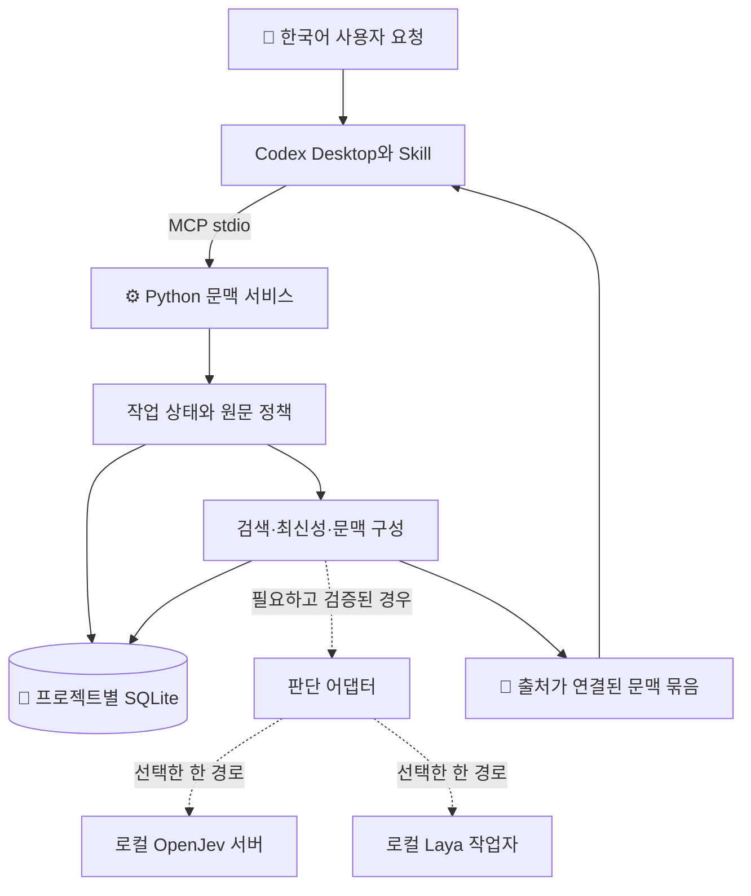

# Codex 로컬 기억·문맥 도구 상세 설계

이전 설계 참고 기록 · 제품 방향·범위·완료 기준은 [통합 설계 2.0](unified-design.md)으로 대체
아래의 현재·미구현·검증 상태는 작성 당시의 기록이며 최신 실행 상태와 구분

상세 설계 1.0 · 2026-09-22 · 구현 전 검토본
사용자 목표는 한국어로 진행하는 긴 작업의 목표·결정·근거를 유지하는 Codex Desktop 보조 도구
이번 산출물은 구현 가능한 구조와 계약이며 프로그램·플러그인·모델 설치를 포함하지 않는 설계

## 한눈에 보는 제품

사용자는 평소처럼 “이어서 해줘”, “근거 찾아줘”, “앞에서 정한 것과 충돌하는지 봐줘”라고 요청
도구는 저장된 작업 상태와 문서를 조회하고, Codex가 원문을 확인하면서 답할 수 있도록 필요한 자료를 제공
모델은 자료를 선별하는 보조 역할이며 작업 목적이나 권한을 단독으로 결정하지 않는 구성

예상 사용 장면

> 사용자: “어제 설계하던 거 이어서 해줘”
>
> Codex: “현재 목표는 설계 문서 완성이고, 구현은 아직 범위에 없어요. 지난번 결정 4개와 보류 항목 2개를 복원했어요. 참고 문서 하나가 바뀌어서 그 부분부터 확인할게요.”

위 문장은 사용자 경험 예시이며 실제 실행 결과와 구분

### 이번에 고정하는 선택

| 결정 | 첫 버전의 설계 |
| --- | --- |
| 핵심 기능 | 작업 재개, 근거 검색, 알려진 충돌·오래된 정보 표시 |
| 사용 장소 | Windows Codex Desktop, 사용자 한 명의 로컬 프로젝트 |
| 기본 연결 | Skill 안내와 MCP 표준 입출력 연결 |
| 기본 실행 | 모델 없는 기억·검색부터 항상 사용 가능 |
| 판단 엔진 | OpenJev 재사용 우선 검토, Laya 다국어 경량 비교 |
| 모델의 초기 상태 | 비활성, 연결과 한국어 평가 후 관찰 모드부터 시작 |
| 한국어 | 원문 보존, 검토한 질문 템플릿, 번역 보조는 후속 실험 |
| 저장 | 프로젝트별 SQLite, 자료 revision과 작업 기록 분리 |
| 언어 | 핵심 서비스 Python, 모델 환경은 핵심 서비스와 분리 |
| 사용자 화면 | 대화 안의 짧은 복원 요약·근거 링크·미확정 사유 |

Python은 Laya 연결과 텍스트 처리의 중복 구현을 줄이기 위한 설계 선택
실제 Python·MCP SDK·모델 의존성 버전은 구현 시작 시 호환 조합을 잠금 파일로 고정
기존에 잘못 착수한 구현의 언어·파일·테스트는 이 선택의 근거에서 제외

### 첫 버전과 확장 범위

| 첫 버전에 포함 | 후속 확장 |
| --- | --- |
| 선택한 프로젝트의 UTF-8 텍스트·Markdown·코드·구조화 로그 | PDF 직접 추출·OCR·웹 자동 수집 |
| 호스트가 전달한 사용자 요청 발췌·결정·검증 보고 | 전체 대화 자동 수집 |
| 작업별 기록과 명시적인 재개 | 검증된 hooks를 통한 재개 안내 |
| 어휘·경로·한국어 부분 문자열 검색 | 임베딩·전용 reranker |
| 기존 충돌 유지와 새 충돌 후보 표시 | 다중 모델 투표·대규모 자동 분류 |
| 엔진 한 개의 선택형 판단 | 번역 모델·학습·이미지 판정 |
| 단일 사용자와 여러 작업의 동시 접근 | 팀 서버·클라우드 동기화·자동 위임 |

PDF와 X에서 추출한 자료도 호스트가 출처·발췌를 제공하면 첫 버전에 기록 가능
직접 읽지 않은 PDF·URL의 발췌는 `supplied_excerpt`로 표시하고 원문 검증 완료로 승격하지 않는 기준
첫 버전이 발견할 수 있는 충돌은 등록된 자료와 전달된 문맥 안의 후보이며 모든 지시 위반을 차단하는 전역 장치로 설명하지 않는 범위

## 실제 사용 흐름

### 처음 연결

1. 프로젝트 루트와 로컬 데이터 저장 위치를 설치 설정에 지정
2. 허용할 자료 종류·제외 경로·Codex에 반환 가능한 범위를 지정
3. MCP 연결에서 상태 조회·작업 열기·원문 읽기 동작 확인
4. 첫 작업의 목적과 범위를 원문 발췌와 함께 기록
5. 모델 없이 같은 작업을 닫았다가 이어서 복원하는지 확인

설치 설정은 별도 설정 행위이며 매 작업마다 다시 승인받는 흐름으로 만들지 않는 기준
새 작업을 열어도 Codex 앱에 새 대화가 생성되지 않고 도구 내부의 작업 기록만 생성
사용자가 “계속”이라고 하면 기존 작업의 목적을 이어받고 이전 미확정 제안을 새 승인으로 바꾸지 않는 동작

### 작업 이어가기

1. Skill이 상태를 조회하고 저장된 작업 ID로 `work_open` 호출
2. 여러 작업 중 대상을 식별할 수 없을 때만 작업 제목을 사용자에게 확인
3. 현재 목표·범위·최근 결정·미해결 충돌을 반환
4. `context_prepare`로 관련 문서의 revision과 원문 확인
5. Codex가 현재 요청과 복원된 기록을 함께 검토해 작업 진행

첫 응답에는 목표 한 줄, 유지할 제약, 바뀐 근거, 다음 행동만 요약
도구 호출이 없었으면 “기억 복원 완료”라고 말하지 않도록 Skill에 명시
필수 지침이나 최신 사용자 요청과 저장된 기록이 다르면 호스트의 지시 우선순위를 따르고 기록의 갱신 필요를 표시

### 새 자료 검토

1. `source_sync`로 허용된 파일 또는 출처가 있는 텍스트 발췌 등록
2. `context_prepare`에 현재 질문과 등록된 자료 ID 전달
3. 검색으로 관련 후보와 알려진 반대 근거를 구성
4. 모델이 준비되고 해당 한국어 과제가 검증됐을 때만 판정 실행
5. 원문 위치·revision·선택 이유·검색 누락 가능성과 함께 결과 반환

### 결과 남기기

1. Codex가 목표 변경·결정·미해결 문제·검증 결과 중 실제 관찰한 내용을 분리
2. `work_record`에 이전 revision과 새 event ID를 함께 전달
3. 저장 성공 응답을 받은 기록만 저장 완료로 보고
4. 동시 변경 시 최신 기록을 다시 읽고 충돌하는 변경만 재검토

검증 성공은 호스트가 전달한 명령·종료 코드·대상 revision에 연결
도구가 직접 실행을 관찰하지 않았으면 `agent_reported`로 표시
작업 완료는 “완료라고 보고됨”과 “필수 검증 증거가 존재함”을 별도 속성으로 표시

## 구성과 실행 경계

아래 도식은 제안 구성으로, 도식이 표시되지 않는 뷰어에서는 뒤의 책임 표로 같은 내용을 확인 가능

| 구성 | 소유 책임 | 소유하지 않는 권한 |
| --- | --- | --- |
| Skill | 호출 시점·도구 결과 해석·짧은 사용자 설명 | 도구 호출 강제·OS 권한 상승 |
| MCP 경계 | 입력 검증·작업 ID·응답·시간 제한 | 외부 임의 명령 실행 |
| 작업 저장 | 기록 revision·중복 방지·변경 이력 | 사용자 승인 진위의 독립 증명 |
| 수집·검색 | 허용 자료·최신성·검색 범위 | 시스템 전체·다른 프로젝트 탐색 |
| 문맥 구성 | 필수 제약·반대 근거·누락 표시 | 호스트의 이미 읽은 문맥 삭제 |
| 판단 어댑터 | 모델별 입력·점수 의미·실패 변환 | 자료 접근 허가·행동 승인 |
| 엔진 | 좁은 질문에 대한 선택·분포 | 최종 사실 확정·실행 완료 선언 |

MCP 프로세스는 호스트 연결별로 시작하고 자료 파일은 읽기 전용으로 접근
기록과 검색 인덱스만 설치 설정에 지정된 데이터 디렉터리에 작성
같은 프로젝트의 여러 MCP 프로세스는 SQLite를 공유하되 DB 쓰기 중 파일 읽기·모델 요청을 기다리지 않는 규칙
핵심 서비스에는 대형 모델 의존성을 설치하지 않고 Laya 작업자·OpenJev 실행 환경을 각각 분리

### 모델 수명과 중복 적재

OpenJev는 미리 준비한 로컬 서버 주소를 설정으로 전달받고 핵심 서비스가 컨테이너 설치·가중치 다운로드를 자동 실행하지 않는 구성
주소는 loopback의 고정 허용 주소이며 redirect·프록시 환경 변수·요청이 지정한 임의 주소를 사용하지 않는 연결
Laya는 전용 환경의 장기 실행 자식 프로세스에 길이가 제한된 JSON 메시지를 표준 입출력으로 전달
운영체제 잠금으로 사용자별 Laya 프로필의 적재 소유자를 하나로 제한하고, 다른 프로세스는 기다리며 중복 적재하지 않고 `engine_busy`로 검색 결과 제공
잠금 소유 프로세스 종료 시 OS가 잠금을 해제하도록 하고 PID 파일만으로 소유권을 판정하지 않는 구현 조건
여러 작업에서 동시 모델 추론이 필요하면 기존 OpenJev 서버 공유를 먼저 검토하고 Laya 공유 서비스는 후속 범위로 유지

### 호스트 연동의 실제 한계

기본 MCP 연결은 도구 호출을 제공하며 모든 사용자 입력이나 모든 도구 결과를 자동으로 관찰하지 않는 경계
저장되는 대화 내용은 Skill이 도구에 넘긴 발췌와 설치 범위 안의 자료로 한정
호스트가 독립 검증 가능한 메시지 식별자를 제공하지 않으면 사용자 발췌도 `agent_reported`로 저장
이 기록을 새로운 승인 토큰이나 호스트 권한 우회 근거로 사용하지 않는 기준

hooks는 후속 연결 시험에서 `SessionStart`의 고정된 복원 안내부터 검토
hook 본문에 원문·모델 판정·비신뢰 경로를 삽입하지 않고 검증된 불투명 작업 ID만 전달
현재 공식 문서는 시작 hook이 MCP 준비보다 먼저 실행될 수 있음을 설명하므로 MCP가 항상 준비되어 있다고 가정하지 않는 설계
근거: [Codex MCP](https://developers.openai.com/codex/mcp), [Codex hooks](https://developers.openai.com/codex/hooks)

## 자료 선택 알고리즘

### 수집과 최신성

파일은 설치 때 정한 루트 안의 상대 경로로 식별하고 junction·symlink·실제 파일 경로가 경계를 벗어나면 제외
검사 후 다른 파일로 바뀌는 문제를 줄이기 위해 실제 열린 파일의 최종 경로와 상태를 검증하고 읽기 전후 변경을 감지
`.git`, 의존성 캐시, 가중치, 비밀 파일 패턴과 설정된 제외 경로는 기본 수집 대상에서 제외
제외 규칙보다 좁은 명시적 추가 허용도 설치 정책으로만 관리하고 문서 내용으로 확장하지 않는 규칙

원본 바이트의 SHA-256으로 revision을 구분하고 수정 시각만으로 최신성을 확정하지 않는 기준
다른 파일의 같은 시점 상태는 보장하지 않으며 일관된 Git revision이 없으면 `per_source_observation`으로 표시
검색 후보로 선택한 원문은 반환 직전 다시 확인하고 변경 시 해당 판정을 취소
새 파일·새 반대 근거를 놓칠 수 있으므로 마지막 수집 범위와 시각을 항상 반환

### 분할과 검색

Markdown 제목·문단과 코드의 행 범위를 기준으로 chunk 생성
초기 최대 chunk는 UTF-8 4KiB, 앞뒤 최대 512바이트의 문맥 연결이며 문자열 중간의 바이트를 자르지 않는 규칙
분할 구간에 걸린 함수·조건·예외는 이웃 구간 참조를 남기고 임의 요약으로 원문을 대체하지 않는 기준
모델 요청 직전에는 선택 엔진 tokenizer로 질문·선택지를 포함한 길이를 다시 계산

검색은 정확한 경로·식별자, FTS5 어휘 검색, Unicode trigram 검색의 순위를 합산
한국어 검색 키에는 NFC 정규화를 적용하되 원문 바이트와 인용 위치는 변경하지 않는 구조
trigram이 매치하지 못하는 1~2자 검색어는 경로·제목의 정확·접두 검색과 제한된 원문 부분 검색으로 보완
원문 부분 검색이 시간 한도 안에 완료되지 않으면 `partial`과 미검색 범위를 표시
FTS5의 3자 미만 제한 근거: [SQLite trigram tokenizer](https://sqlite.org/fts5.html#the_trigram_tokenizer)

기본 후보 상한 40개, 모델 재정렬 대상 최대 8개, 원문 연결 기준 동점은 안정적인 ID 순서로 처리
여러 순위를 결합하는 초기 규칙은 각 검색 채널의 `1 / (60 + rank)` 합산이며 숫자는 첫 구현의 조정 가능한 기본값
필수 제약과 알려진 미해결 충돌은 순위 밖에서 별도로 포함
모델 평가가 없는 초기 상태에서는 검색 후보를 모델 점수로 제외하지 않는 구성

### 문맥 묶음

| 묶음 항목 | 내용 | 공간 부족 시 |
| --- | --- | --- |
| 작업 | 목표·범위·work revision | 유지, 초과하면 묶음 구성 실패 |
| 보호 항목 | 적용 지침·명시 제약·알려진 미해결 충돌 | 누락 금지, `insufficient` 반환 |
| 근거 | 질문 관련 발췌·반대 근거·실패 결과 | 원문 참조와 포함 범위 표시 |
| 상태 | 수집 범위·파일 변경·판정 미수행·누락 | 작은 상태 필드로 항상 유지 |

초기 문맥 예산은 UTF-8 본문 16KiB, 절대 상한 64KiB
호스트 tokenizer를 확인하기 전에는 바이트 제한을 Codex 토큰 절감 수치로 바꾸지 않는 기준
반환 항목에는 source ID·revision·행 또는 발췌 위치·내용 hash를 함께 포함
필수 항목만으로 예산 초과 시 길이를 조용히 자르지 않고 필요한 최소 크기와 원문 조회 방법을 반환

## 판단 모델과 한국어

엔진 상태는 `disabled`, `unavailable`, `warming`, `shadow`, `active`, `degraded`로 관리
초기값은 `disabled`, 파일 준비와 연결 검증 후 `shadow`, 한국어 평가와 자원 기준을 통과한 프로필만 `active`
관찰 모드에서는 판정을 기록하되 검색 후보 제외·자동 결정 확정에 사용하지 않는 규칙
활성 상태도 추천·관련성 보조에 한정하고 필수 원문·권한·완료 조건을 덮어쓰지 않는 경계

첫 질문 종류는 관련성, 주장과 근거의 관계, 스킬 후보 적합성
모든 질문에 `insufficient_evidence`를 표현할 경로를 두고 실행 실패와 의미적 해당 없음을 구분
한국어 요청과 코드가 섞이면 자연어 요청 부분의 언어를 별도 기록
검토한 한영 질문 템플릿을 비교하되 사용자에게 영어 입력을 요구하지 않는 구성

번역 모델은 첫 버전의 필수 구성에서 제외하고 직접 판정이 실패한 유형에서만 후속 실험
번역 도입 시 원문·번역 대응과 부정·예외·승인 범위 보존을 검증하며 두 판정의 일치를 정답 증명으로 사용하지 않는 기준
한국어 처리 근거와 실험안은 [모델 비교](local-models.md), 구체 사례는 [초기 평가 사례](pilot-cases.md) 참조

## 시간·자원·실패 정책

다음 수치는 성능 실측이 아닌 첫 구현의 제안 기본값이며 설정으로 조정 가능

| 항목 | 기본값 | 초과·실패 시 |
| --- | --- | --- |
| 작업 복원 목표 | warm p95 500ms | 지연 기록, 허위 성공 금지 |
| 문맥 준비 시간 한도 | 5초 | 확보한 근거와 `partial` 반환 |
| 모델 추론 예산 | 남은 시간 중 최대 2초 | 판정 유보, 같은 호출 안 자동 재시도 없음 |
| 엔진 준비 | 명시적 준비 단계 | cold loading을 5초 요청 안에 숨기지 않는 구성 |
| 로컬 쓰기 잠금 대기 | 최대 1초 | `busy`, 동일 event ID로 재시도 가능 |
| 파일 동기화 | 호출당 최대 32개·5초 | 완료 목록과 미처리 목록 반환 |
| 단일 텍스트 파일 | 최대 2MiB | 명시적 제외 사유, 부분 전문인 척 처리 금지 |
| 핵심 서비스 RAM 목표 | 모델 제외 512MiB 이하 | 과부하 원인 표시, 작업 크기 축소 |
| 저장 예산 | 프로젝트당 512MiB | 자동 원문 삭제 대신 신규 수집 중지 |

취소·시간 초과 시 이미 커밋한 기록을 없던 일로 취급하지 않는 원칙
모델 결과가 늦게 도착하면 끝난 요청의 문맥 묶음을 바꾸지 않고 폐기
호출 취소가 GPU 실행 중지를 보장하지 않으므로 시간 초과 프로필은 degraded로 전환하고 처리 종료 확인 전 새 모델 요청을 보내지 않는 규칙
Laya 자식 프로세스는 종료·정리 확인 후 명시적으로 다시 준비하고 OpenJev는 서버 처리 상태를 확인할 수 없으면 재연결 점검 전 검색 모드 유지
정해진 제한 안에서 검색 결과를 제공할 수 없는 DB 장애는 오류로 반환하고 기억이 없는 것처럼 보고하지 않는 기준

## 보존·수정·삭제

원문과 기록은 프로젝트별 DB에 저장하고 OS 사용자 권한으로 접근 제한
DB·FTS·로그에 비밀이 들어가지 않도록 수집 정책 적용, 전체 암호화는 첫 버전의 보증 범위에서 제외
로그에는 기본적으로 ID·단계·지연·오류 코드만 기록하고 원문·모델 입력 전문은 저장하지 않는 정책
삭제 요청은 파생 chunk·판정·문맥 묶음·FTS에도 전파하고 이후 조회를 차단
SSD·외부 백업·사용자가 내보낸 파일의 물리적 소거까지 보장하지 않는 범위
복구용 백업과 파일 이동은 [저장·처리 설계](storage-and-flows.md)의 절차로 제한

## 구현 단위와 완료 기준

| 단계 | 만들 범위 | 완료를 보여주는 결과 |
| --- | --- | --- |
| A | 프로젝트 설정·MCP·SQLite·작업 기록 | 연결 종료 후 같은 작업 복원, 동시 갱신 충돌 감지 |
| B | 원문 수집·검색·원문 조회 | 한국어 짧은 검색어, 수정·삭제·경계 밖 경로 검증 |
| C | 문맥 구성·충돌 상태 | 필수 근거 누락 없이 예산 초과·미확정 표시 |
| D | OpenJev와 Laya 어댑터 | 엔진 교체·장애·점수 의미·입력 제한 검증 |
| E | 실제 Desktop와 한국어 평가 | 30개 실제 과제, 원문 추적과 호출 누락 관찰 |
| F | 선택형 hooks·번역·추가 검색 | 앞 단계에서 확인된 구체적 부족을 개선한 증거 |

A~C는 모델 없는 제품의 최소 완성 범위이며 D~E에서 모델 활성화 여부 결정
한국어 오판 감소와 전체 작업 시간의 이익이 없으면 모델 없는 구성을 기본값으로 유지
표본 30개는 탐색 평가이며 일반적인 정확도 보증이나 출시 규모의 통계 검증과 구분
상세 계약은 [도구 계약](tool-contracts.md), 상태·동시성은 [저장·처리 설계](storage-and-flows.md)에서 관리

## 미확정 항목과 확인 상태

제품 동작·도구 이름·저장 책임·한국어 정책·실패 동작은 이 상세 설계에서 제안 기본값으로 고정
남은 환경 선택은 가용 RAM/GPU, 모델 revision, 실제 Desktop 연결과 hook 동작, 실측에 따른 자원 설정
장비 조회는 현재 환경에서 접근 거부되어 RAM·GPU 사양은 미확인
읽기 전용 확인에서 번들 CLI `0.155.0-alpha.9.2`를 관찰했으나 이를 Desktop의 MCP·hook 호환성 증명으로 사용하지 않는 기준
로컬 구현·연동 시험·모델 평가·Mermaid 렌더는 미실행
문서 구조·링크·예제 검사는 별도 검증 기록으로 보고

## 설계 근거의 위치

기존 PDF·X 분석과 설계 원칙은 [방향 설계 0.4](proposal.md), [원문 비교](source-comparison.md)에 보존
첫 버전의 범위와 구체적인 기본값은 이 상세 설계를 우선하며 사용자 요구사항은 모든 문서보다 우선
현재 문서는 제안한 제품 설계이며 외부 자료가 이 전체 구조를 보증한다는 의미로 사용하지 않는 기준
