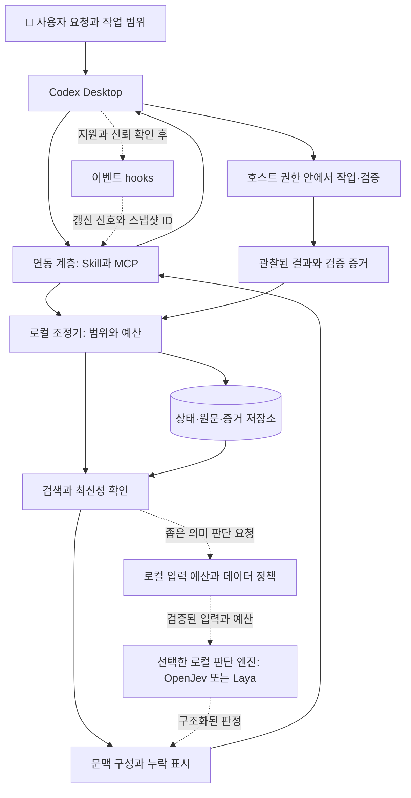

# Codex Desktop용 로컬 기억·문맥 도구 설계안

이전 설계 참고 기록 · 제품 방향·범위·완료 기준은 [통합 설계 2.0](unified-design.md)으로 대체
아래의 현재·미구현·검증 상태는 작성 당시의 기록이며 최신 실행 상태와 구분

설계안 0.4 · 2026-09-22 · 공개 판단 엔진 재사용과 한국어 우선 검증
이 문서는 조사와 방향 선택의 근거이며 첫 버전의 기능·저장·인터페이스·자원 기본값은 [상세 설계 1.0](detailed-design.md)에서 구체화
실제 사용자 흐름부터 읽을 때는 상세 설계를 시작점으로 사용
PDF와 X 글의 공통 원리를 Codex Desktop의 실제 사용 경험으로 연결하는 설계
기존에 작성된 프로그램의 기능·언어·도구 이름·테스트 결과를 이 설계의 요구사항이나 달성 근거로 사용하지 않는 기준
원문별 비교는 [자료 비교](source-comparison.md), 실패 사례와 평가 기준은 [검증 설계](acceptance.md) 참조
사용자 요청에 따라 OpenJev/DiffusionGemma를 우선 검토하고 Laya를 경량 비교 후보로 유지하는 [모델 선택 설계](local-models.md)
Jev는 원문 분석의 대상에만 남기고 제품의 호출·실패 대체·필수 평가 경로에서 제외

## 쉽게 보는 이번 결정

만들 도구의 목적은 긴 작업에서 Codex가 목표를 기억하고, 필요한 자료를 찾고, 서로 다른 지시나 오래된 정보를 놓치지 않도록 돕는 것
예를 들어 “설계만 작성”이라는 약속을 기억하고, 다음에 “이어서 해줘”라고 해도 설계 작업을 이어가는 경험

| 사용자에게 필요한 일 | 우리가 설계할 부분 | 기존 공개 도구를 활용할 부분 |
| --- | --- | --- |
| 이전 작업 이어가기 | 목표·결정·진행 상태의 기록과 복원 | 로컬 저장 기술 |
| 필요한 근거 찾기 | 자료 검색·출처 연결·중요 근거 보존 | 검색 기술과 선택형 판단 엔진 |
| 상충하거나 오래된 정보 알아보기 | 버전 확인·양쪽 근거 표시·미확정 상태 유지 | 관련성·충돌 가능성을 평가하는 판단 엔진 |

판단 엔진은 자료를 읽고 정해진 질문에 답하는 부품이며, 작업 기록과 원문은 엔진을 바꿔도 유지하는 구조
OpenJev를 우선 검토하되 하드웨어·한국어 품질·응답 시간을 비교한 뒤 기본 엔진 결정
한국어 원문을 기본으로 보존하고 한국어 평가를 통과한 기능만 자동 적용 후보에 포함
번역은 검증할 보조 수단이며 원문 의미가 불명확하면 원문과 주변 대화를 함께 반환하는 방식
작은 자원에서 사용할 Laya와 모델 없이 검색하는 구성도 같은 제품에서 선택 가능하도록 설계
첫 범위는 위 세 가지 사용자 경험과 명시적 호출이며, 자동 hooks·추가 모델·별도 관리 화면은 효과 확인 후 확장
현재 산출물은 설계 문서이며 설치·프로그램 구현·모델 실행은 후속 구현 단계의 작업

## 사용자가 얻어야 할 결과

긴 작업을 이어갈 때 Codex가 현재 목표와 중요한 결정을 복원하고, 지금 필요한 근거를 찾고, 불확실한 판단을 드러내며 작업하는 경험
반복되는 자료 수집과 불필요한 모델 호출을 줄이되, 지침 누락·오래된 근거·잘못된 완료 보고를 증가시키지 않는 목표

대표 요청은 “이 설계를 이어 검토해줘”, “인증 오류의 원인을 찾아줘”, “수정 내용이 요구사항을 만족하는지 확인해줘”
첫 요청에서 설계와 구현의 범위를 명시하고 이후 “진행해줘”가 기존 범위를 이어받도록 작업 목적을 보존
“설계”를 기록한 상태에서는 추가 기능을 만들자는 표현만으로 구현·설치·배포까지 승인된 것으로 바꾸지 않는 원칙
새로운 명시적 사용자 지시가 오면 범위를 갱신하고, 과거에 추정한 범위가 최신 지시를 가로막지 않도록 근거와 변경 이력 유지

### 로컬의 의미

기본 제안은 프로젝트 상태·검색 인덱스·판단 기록을 사용자 컴퓨터에 보관하는 방식
판단 엔진은 교체 가능하며 OpenJev/DiffusionGemma와 Laya multilingual을 로컬 실행 조건에서 비교하는 구성
모델 미준비·자원 부족 상태에는 기본 검색과 원문 조회로 동작하고 의미 판정 미수행을 명시
이 도구가 추가하는 판단·검색 모델의 유료 API 호출 비용을 0으로 유지하는 요구사항
모델 파일 준비 비용, CPU·GPU·메모리·전력 사용과 기존 Codex 요금·할당량은 별도 항목
Codex 본체가 전달받은 자료를 처리하는 경로까지 이 도구가 오프라인으로 바꾸지는 않는 경계
전체 처리의 오프라인 보장이 요구되면 호스트 에이전트와 생성 모델 선택까지 요구사항을 확장해야 하는 조건

## 사용 흐름

다음 예시는 제품의 목표 동작이며 실행 결과가 아닌 시나리오

### 이전 설계를 이어 검토

1. 현재 작업 목적이 설계 검토인지, 대상 프로젝트가 맞는지 확인
2. 마지막 결정·보류 쟁점·관련 문서의 현재 버전을 복원
3. 관련성이 있는 근거와 반대 근거를 함께 구성
4. “자동으로 판단할 수 있는 부분”과 “사용자 선택이 필요한 부분”을 설명
5. 이번에 합의된 내용만 결정으로 기록하고 나머지는 제안 상태 유지

사용자에게 보이는 예시

> 현재 범위는 설계 검토이며 구현 착수는 미결정
> 이전 결정 3건 중 1건의 근거 문서가 변경된 상태
> 검토할 쟁점은 자동 호출 범위와 로컬 판단 모델의 필요성

### 코드 문제 조사

요청 경로·현재 변경분·최근 실패 증거로 검색 범위를 구성
원문을 읽어야 할 부분과 짧은 발췌로 충분한 부분을 구분하고, 과거에 실패한 해결책도 관련성이 있으면 유지
수정·실행은 Codex의 기존 권한 체계에서 수행하고, 검증 명령·결과·대상 revision을 증거로 저장
명령을 제안한 상태, 실행이 시작된 상태, 성공 결과를 관찰한 상태를 구분

### 세션 중단 후 재개

저장된 요약에 더해 출처 버전과 아직 해결되지 않은 문제를 확인
원본·지침·작업 범위가 바뀌었으면 영향받는 자료와 판단만 갱신
서버 장애나 모델 연결 실패는 기능 상태로 표시하고, 없는 기억을 만들어 작업을 이어가지 않는 동작

## 설계 원칙

- 목표·허용 범위·원문·해석·실행 증거를 구분하는 데이터 모델
- 원문에 다시 도달할 수 있는 선택·요약·인용
- 중요 지침·반대 근거·실패 사실이 일반 관련성 점수에 밀리지 않는 문맥 구성
- 모델 점수가 권한이나 작업 완료를 만들어내지 않는 처리 경계
- 불확실성·부분 검색·누락·오래된 자료를 표현할 수 있는 결과 계약
- 효과를 측정하고 개선이 없는 기능을 끌 수 있는 모듈 구성

## 구성과 책임

아래 구성도는 제안 구조이며 배포된 시스템을 뜻하지 않는 도식
실선은 기본 흐름, 점선은 조건부 활성화하는 자동화 또는 판단 흐름
Mermaid를 지원하는 뷰어에서 표시 가능하며, 같은 책임을 아래 표에서도 확인 가능

| 구성 | 맡는 일 | 판단·책임의 경계 |
| --- | --- | --- |
| Desktop 연동 | 요청·원문 조회·결과 전달·선택형 이벤트 연동 | 호스트의 현재 기능과 권한 범위 내 동작 |
| 로컬 조정기 | 작업 범위, 프로젝트 분리, 예산, 작업 상태 | 모델 답과 독립된 결정적 규칙 |
| 자료 수집·검색 | 허용된 자료 수집, 변경 감지, 후보 추출 | 검색 범위를 결과에 명시 |
| 문맥 구성 | 필수 정보 보존, 가시성 선택, 원문 추적 | 불완전한 묶음을 완전하다고 보고하지 않는 책임 |
| 판단 계층 | 공개 판단 엔진 연결, 엔진별 입력·출력 검증 | 좁은 선택·점수·유보 결과, 권한 결정과 분리 |
| 검증·평가 | 실행 증거 연결, 회귀 평가, 비용·지연 측정 | 의미 점수와 실제 실행 결과 구분 |

이 도구가 추가하는 판단·임베딩·검색·백그라운드 처리 모델은 로컬 실행으로 제한
문맥 요약은 기본적으로 원문 발췌를 사용하고, 사용자가 요청한 생성 작업은 기존 Codex 작업 흐름에서 처리
별도의 유료 요약·번역·재판정 API를 암묵적으로 추가하지 않는 구성

## Desktop 연동 선택

| 대안 | 장점 | 제약 | 제안 |
| --- | --- | --- | --- |
| Skill과 MCP | 명시적으로 호출 가능, 연결 경계가 단순 | 호출 누락 가능, 자동 수집 범위 제한 | 모든 설치의 기본 경로 |
| 기본 경로와 hooks | 재개·입력·변경 시 자동 복원 가능 | 호스트별 지원·신뢰·출력 역할 확인 필요 | 확인된 이벤트부터 단계적으로 활성화 |
| 별도 하네스 | 문맥 조립·위임·캐시 전략을 직접 설계 가능 | 별도 실행 제품과 운영 비용 | Desktop 도구와 분리된 연구 경로 |

추천 제품 형태는 로컬 서비스와 Desktop 연결 패키지
첫 설치에서 호스트 기능·버전·프로젝트·승인된 자료 범위를 확인해 기능 상태를 표시
현재 공식 계약의 근거와 hooks 제약은 [자료 비교](source-comparison.md)에 정리

hook은 기본적으로 고정된 사용 안내와 검증된 스냅샷 참조만 전달
자료 본문·모델 판정·파일에서 읽은 지시를 높은 권한의 문맥으로 옮기지 않는 설계
빠른 로컬 처리를 넘는 모델 호출은 첫 단계에서 동기 hook의 필수 경로로 두지 않는 선택

호스트가 이미 읽은 문맥의 존재·삭제 여부를 확실히 관찰할 수 없으므로 반복 전송과 절감 효과를 별도 측정
문맥 교체·네이티브 모델 라우팅·KV 캐시 제어는 해당 호스트 계약을 확인한 기능에 한해서만 확장

## 상태와 근거 모델

### 저장 단위

| 단위 | 핵심 정보 | 필요한 이유 |
| --- | --- | --- |
| 작업 범위 | 목적, 허용 행위, 산출물, 명시된 제외, 근거 사용자 메시지 | 설계에서 구현으로의 임의 확장 방지 |
| 자료 | ID, 종류, 프로젝트, 경로·URL, 원문, hash, 관찰 시각 | 변경 확인과 정확한 원문 복구 |
| 자료 버전 | revision, 수집 당시 상태, 대체 관계 | 과거 판정 재현과 현행성 구분 |
| 결정 | 제안·채택·폐기, 근거, 적용 범위, 결정 주체 | 모델 제안의 자동 확정 방지 |
| 실행 증거 | 명령·도구, 대상 상태, 시작·종료, 종료 코드, 결과 참조 | 실행과 성공 보고의 추적 |
| 의미 판정 | 질문·기준 버전, 모델, 입력 hash, 답·분포·유보 | 판정 재현과 평가 |
| 문맥 묶음 | 목적, 선택 revision, 표현 방식, 예산, 누락, 커버리지 | 누가 어떤 근거로 판단했는지 확인 |
| 하위 작업 | 목표·입력 상태·허용 범위, 소유자, 임대, 결과 | 중복 실행과 잘못된 결과 합류 억제 |

모든 자료에 사실성·현재성·민감도·지시 출처를 서로 다른 속성으로 유지
“공개 자료”는 “신뢰할 지시”가 아니며, “과거에 맞았던 결과”는 “현재도 맞는 결과”와 다른 상태
사용자 승인 근거는 host가 제공한 식별 정보가 있으면 연결하고, 없으면 에이전트가 기록한 요약으로 표시
에이전트가 입력한 “승인됨” 텍스트만으로 승인 토큰을 만들어내지 않는 규칙

### 작업 경계

프로젝트 ID·저장소·worktree·branch·commit·미커밋 변경 hash를 필요한 단위로 구분
같은 경로명이어도 다른 worktree의 결과를 현재 결과로 사용하지 않는 기준
Git 없는 프로젝트는 루트 식별자와 자료 hash로 상태 표현
프로젝트 사이의 공유는 허용된 공개 자료와 명시된 공통 결정에 한정하는 기본값

### 최신성과 스냅샷

스냅샷은 선택된 revision을 고정한 과거 관찰 묶음
“당시 자료를 재현할 수 있음”과 “현재 자료와 일치함”을 별도 표시
여러 파일을 읽는 동안 발생한 변경을 감지하면 묶음을 재시도하거나 불안정 상태로 반환
모든 파일이 같은 시점에 존재했다는 보장이 필요하면 Git revision 또는 실제 파일 스냅샷을 사용해야 하는 조건
누락된 파일·파싱 실패·변경 중인 원본을 조용히 제외하고 완전한 결과를 선언하지 않는 계약

### 수집과 보존

수집 대상은 사용자가 선택한 프로젝트의 허용된 자료, 현재 작업에서 사용한 원문, 관찰 가능한 도구 결과
전체 홈 디렉터리·다른 작업 기록·비공개 추론 과정의 수집은 기본 입력원에서 제외
로그는 크기 제한과 원문 참조를 함께 제공하고, 민감한 로그의 전문 보존은 별도 정책으로 관리
저장 기간·최대 디스크 사용량·삭제·내보내기·백업을 제품 설정에 포함
원문 삭제가 요청되면 관련 발췌·요약·임베딩·스냅샷도 삭제하거나 무효화하고, 이후 재현 불가 상태를 명시
“불변 스냅샷”이 삭제 요구보다 우선하는 영구 보존 약속이 되지 않도록 정의

## 문맥 선택 절차

1. 현재 요청과 작업 범위를 읽고 필요한 자료 종류·영향 경로를 정리
2. 필수 제약과 알려진 미해결 충돌을 검색 점수와 독립적으로 확보
3. 파일 경로·식별자·어휘·구조로 후보를 넓게 찾고 필요할 때 의미 검색 추가
4. 변경·삭제·권한·민감도를 확인한 뒤 적격 후보만 판단 계층에 전달
5. 관련성, 반대 근거 여부, 필요한 상세도를 별개의 질문으로 평가
6. 필수 정보와 의존 관계를 먼저 배치하고 남은 예산에서 일반 자료 선택
7. 원문 참조·선택 이유·누락 이유·검색 범위와 함께 문맥 묶음 반환

처음부터 모든 자료를 판단 엔진에 넣는 방식은 입력 길이와 처리량 제한 때문에 기본 경로에서 제외
후보 검색이 놓친 자료는 후속 모델도 선택할 수 없으므로 후보 재현율을 독립 지표로 평가
검색에서 답을 못 찾으면 검색 범위를 넓힐지, 추가 자료가 필요한지, 유보할지 명시

### 문맥의 보호 순서

| 우선순위 | 내용 | 예산이 부족할 때 |
| --- | --- | --- |
| 필수 | 현재 목표·범위, 적용 지침, 중요 미해결 충돌의 존재 | 크기 확대·범위 재설정·불충분 상태 반환 |
| 판단 필수 | 관련 반대 근거, 실패 증거, API 제약, 현재 변경분 | 원문 확보 전 해당 판단 보류 |
| 선택 | 반복 설명, 관련 참고 자료, 과거 대안 | short·long·hide로 조정 |

필수 지침의 적용 여부는 경로·명시된 조건·호스트 우선순위를 기준으로 결정
기존 AGENTS의 구속력 있는 내용을 관련성 점수로 재작성·삭제하지 않는 원칙
조건이 자연어라 불확실하면 현재 작업에 적용될 가능성을 표시하고 보수적으로 원문 확인

### 표현 방식

`hide`는 현재 전달에서 제외, `short`와 `long`은 전달량 등급, `full`은 선택 단위의 전체 원문을 의미
표현 방식과 별도로 `원문 발췌`·`생성 요약`을 표시하고 서로 혼동하지 않는 계약
원문 발췌를 기본으로 하고 생성 요약은 길이 대비 이익이 있는 자료에 선택적으로 적용
요약에는 원문 revision·범위·작성 모델·검증 상태를 연결하고 숫자·부정·예외·실패 조건을 보존
형식이 맞거나 다른 모델이 동의했다는 이유만으로 요약을 검증 완료로 승격하지 않는 기준

예산은 원문 바이트, 전달 바이트, 토큰 추정, 실제 관찰된 모델 사용량으로 구분
토크나이저를 알 수 없으면 추정치임을 표시하고 호스트 전체 문맥 사용량과 동일시하지 않는 기준

## 판단 모델 사용

모델을 호출할 판단은 “검색 후보 중 이 요청과 관련 있는가”, “이 근거가 주장을 지지·반박하는가”, “등록된 스킬이 적용되는가”처럼 범위가 작은 질문
파일 존재·날짜·hash·금액 계산·허용 경로·실행 종료 코드 등 확정 가능한 검사는 코드가 처리
OpenJev·Laya의 실제 인터페이스·제약과 기능별 대안의 차이는 [모델 비교](local-models.md)에 명시

### 엔진 선택과 실행

기본 검색과 원문 조회를 모델 없이 제공하고, 같은 검색 후보를 이용하는 OpenJev와 Laya를 우선 비교
OpenJev는 Jev 호환 서버 재사용 후보이며 실제 가중치·실행체·하드웨어 호환성 확인 후 평가에 포함
Laya는 한국어·한영 혼합 작업을 위한 multilingual 체크포인트를 경량 후보로 사용
동시에 여러 엔진을 적재하거나 요청별로 무작위 전환하지 않고, 작업별로 검증된 한 프로필을 명시적으로 선택
모델·서버 revision·질문 형식·점수 정의가 바뀌면 기존 판정 캐시와 임계값을 그대로 재사용하지 않는 기준

선택한 엔진의 서버 또는 작업자는 장기 실행하는 로컬 프로세스로 분리하고, 매 요청마다 가중치를 다시 로드하지 않는 설계
프로세스 시작·모델 로딩·준비 완료·처리 중·메모리 부족·종료 상태를 구분
가용 장비가 미확인인 현재는 검색 모드를 보장할 기본 경로로 설정하고 모델 자동 설치·장비 구매를 요구하지 않는 설계
OpenJev의 GPU·MLX 경로와 Laya의 CPU·GPU 경로는 각각 독립적으로 검증하며 OpenJev CPU 실행을 기본 호환 경로로 약속하지 않는 기준
사용자 컴퓨터의 장비·실행 호환성·실용적인 응답 속도는 아직 미측정

각 질문의 실제 tokenizer와 입력 구성 방식을 기준으로 원문·질문·선택지의 토큰을 모두 계산
초과 입력을 모델 내부의 조용한 잘림에 맡기지 않고 구조 단위로 분할하거나 `input_incomplete`로 반환
분할 시 부정·예외·호출 관계를 잃을 수 있으면 전후 원문을 확보하고 관계가 여전히 불명확하면 유보
조각별 높은 점수를 평균해 전체 근거가 충분하다고 결론 내리지 않는 규칙

스킬은 기본 검색으로 후보를 줄인 뒤 짧고 구별되는 설명과 함께 선택한 엔진에 전달
후보 수의 초기 실험 범위는 3~8개와 해당 없음이며, 고정 제품 한도는 실험 후 결정
필수·명시 스킬은 후보 검색과 무관하게 보존하고 후보 밖 정답을 놓치는 비율도 측정
언어 비율·토큰 예산·후보 목록·잘림 여부를 판정 기록에 포함

다른 모델로 교체할 때도 관련성 점수·NLI 결과·다중 라벨 점수를 공통 confidence로 위장하지 않는 내부 계약
판정 기록에 원래 출력, 점수 종류, 정규화 방식, 모델·tokenizer·보정 revision을 함께 저장
모델이 원래 지원하지 않는 기능은 `unsupported`로 표시

### 결과와 유보

모든 의미 판단에 적합, 부적합, 근거 부족을 표현할 경로 제공
후보 전체 미수집·시간 초과·정책 차단·제공자 오류는 의미적 “해당 없음”과 별도 상태
스킬 선택은 한 개를 강제하지 않고 필요 시 복수 후보와 적용 순서를 추천
필수 스킬·사용자가 명시한 스킬은 추천 점수로 탈락시키지 않는 기준

판정 기준은 작업별로 관리하고 개발용 예제로 조정한 뒤 보류 평가 세트에서 검증
confidence는 엔진별 정의를 보존하고 같은 숫자를 같은 정답률로 해석하지 않는 기준
해당 체크포인트·서버 구현·언어·질문·후보 수별 평가 결과로 임계값을 선택
보정 데이터와 최종 평가 데이터를 분리하고 score·noul·choice를 각각 평가
미검증 모델은 관찰 모드에서 추천과 실제 선택의 차이만 기록

### 한국어와 한영 혼합 입력

한국어 정확도를 제품 채택의 필수 기준으로 두고 영어 성능·다국어 지원 표기로 대신하지 않는 원칙
Jev의 언어 한계와 OpenJev의 품질은 다른 모델의 문제이며 Jev API 호환성을 동일한 언어 성능으로 해석하지 않는 기준
근거와 구체적인 보완안은 [한국어 처리 설계](local-models.md#한국어-처리-설계)에 정리

기본 경로는 한국어 원문과 한영 혼합 코드를 그대로 읽는 검증된 다국어 프로필
모델 입력에서는 원문·질문·선택지의 언어를 각각 기록하고 영어 코드 비율만으로 한국어 요청을 영어 전용 모델에 보내지 않는 기준
반복 사용하는 질문·선택지 설명은 검토된 한영 템플릿으로 준비하고 짧은 의미 단위로 질문 분리
원문이 한국어인 상태에서 질문만 영어로 바꾸는 방법도 별도 평가 대상으로 관리

직접 판정이 부족한 과제는 로컬 번역을 추가한 경로를 실험하되 제품 기본값은 비활성
원문과 번역의 대응 위치·revision·번역 모델·용어집을 유지하고 코드·경로·수치·단위를 원형으로 보존
번역 누락·원문과 번역 판정의 불일치·대화 대상 불명은 유보 사유로 처리
일치한 두 판정도 같은 오류를 공유할 수 있으므로 일치만으로 검증 완료나 확신도 상승을 선언하지 않는 기준

“설계만”, “아직 실행하지 마”, “그건 빼고” 같은 제약은 해당 원문과 확정된 작업 범위에 연결
“일단 그렇게 해줘”는 직전 제안과 현재 작업 범위를 함께 확인하고 주어·대상 생략을 임의로 보충하지 않는 설계
의미 추출 결과를 검증 전 제안으로 유지하고 번역·키워드·고확신 판정만으로 승인 범위를 확대하지 않는 규칙
해당 언어·과제의 평가 미달 시 점수와 무관하게 의미 판정을 비활성화하고 Codex에 원문 근거·미확정 사유를 반환
사용자 재질문은 원문과 주변 맥락으로도 해결되지 않은 경우에 한정

### 인용과 주장 검토

인용 문자열의 존재, 해당 문맥에서의 의미 지원, 출처의 신뢰성, 실제 시스템의 동작을 서로 다른 확인 단계로 관리
예를 들어 “자동 배포 비활성”이라는 원문은 “자동 배포 활성”의 근거가 될 수 없다는 판정 대상
주장을 반박하는 다른 자료와 문서 간 버전 차이까지 함께 확인
한 출처의 지원 판정만으로 전체 세계의 사실이나 코드 테스트 통과를 확정하지 않는 기준

### 로컬 실행과 자원 정책

초기 준비 단계에서 선택한 체크포인트·tokenizer·설정·필수 기반 모델 파일을 고정 revision으로 확보하는 설계
실제 추론은 확보된 로컬 파일만 읽고, 누락 파일은 준비 필요 상태로 반환
자동 업데이트·외부 텔레메트리·런타임 다운로드 여부를 점검하고 네트워크를 차단한 시험으로 검증
Jev API 키나 원격 모델 주소가 환경에 존재하더라도 이 판단 계층은 사용하지 않는 계약

자료의 민감도는 로컬 저장·로그·Codex 반환에서도 유지
로컬 모델이 읽을 수 있다는 사실이 해당 자료를 Codex에 전달해도 된다는 권한을 만들지는 않는 기준
모델 실패 시 결과를 유보하고 원문을 확인할 수 있도록 반환하며 별도 유료 재판정 요청을 생성하지 않는 동작

동시 요청·대기열·입력량·시간·RAM·VRAM에 한도를 두고 과부하 시 배치 크기 축소 또는 검색 모드로 저하
메모리 부족 재시도 횟수를 제한하고 작은 배치나 지원되는 CPU 경로 전환도 사전 설정과 제한 시간 안에서만 수행
OpenJev 장애를 계기로 검증하지 않은 Laya 판정을 자동 적용하지 않고 기본 검색으로 저하
지연·전력·Codex의 추가 재검토량을 기록해 로컬 실행의 실제 비용을 평가
패키지·가중치·tokenizer·보정값·정밀도 변경은 묶음 버전으로 평가하고 이전 조합으로 복귀 가능하게 관리

## 캐시와 위임

### 캐시

캐시를 자료 추출 결과, 검색 후보, 의미 판정, 문맥 묶음으로 분리
원문 hash·질의·적용 규칙·질문 버전·모델/보정/tokenizer 버전·서버/실행체 revision·정밀도·샘플링 설정·검색 인덱스 revision이 바뀌면 영향받는 캐시 무효화
새 자료가 추가됐을 때도 기존 검색 결과를 재사용하지 않도록 후보 집합 버전을 포함
권한 변경은 캐시 적중 이후에도 다시 확인
로컬 캐시가 호스트의 prompt cache나 실제 KV cache를 제어한다고 표현하지 않는 기준

### 하위 작업

중복 판정 키는 목표만으로 만들지 않고 작업 유형·프로젝트·입력 snapshot·대상 범위·완료 조건을 포함
새 commit의 재검토나 의도된 독립 검토까지 중복으로 막지 않도록 역할·반복 식별자 지원
의미적으로 비슷한 목표는 중복 후보로 제안하고 실제 실행 취소는 확정 규칙으로 판단

동일 snapshot의 검색 결과를 공유하되 검토 관점별 추가 자료 요청을 허용
한 번의 검색 누락을 모든 검토자가 공유하는 위험을 줄이기 위해 중요 판단에는 독립 검색 경로 포함
읽기 전용 검토자와 쓰기 작업자를 구분하고 쓰기 범위·worktree 소유권·합류 검증을 별도 관리
임대 만료·작업 취소·프로세스 종료 뒤의 오래된 결과는 현재 작업에 자동 합류하지 않는 조건
임대 기록만으로 실행 중인 프로세스가 중지되거나 파일 쓰기가 차단되지는 않으므로 실제 쓰기 경계는 호스트의 격리·잠금·revision 검사로 확보
작업 등록의 중복 억제를 외부 효과의 정확히 한 번 실행 보장으로 설명하지 않는 기준

위임 비용은 자료 준비·하위 모델 입력/출력·부모 재검토·실패 재시도·사용자 확인 시간까지 합산
구독 할당량과 API 과금은 같은 금액으로 환산하지 않고 관찰 가능한 지표로 각각 비교
독립 작업의 품질과 총시간·비용에서 이점이 확인될 때만 자동 위임 후보로 활성화
이번 무료 판단 계층은 별도 유료 하위 모델을 연결하지 않으며, Codex의 기존 하위 작업 사용량은 host 비용으로 별도 집계

## 실패와 복구

| 상황 | 사용자에게 알려줄 상태 | 후속 처리 |
| --- | --- | --- |
| 저장소 접근 실패 | 기억 복원 불가 | 원문 기반 작업 가능 여부 표시, 새 기록 성공 주장 금지 |
| 판단 모델 장애 | 의미 판정 미수행 | 기본 검색 결과 제공, 미검증 판단은 유보 |
| 모델 파일 누락 | 로컬 모델 준비 필요 | 자동 다운로드·유료 API 전환 없이 기본 검색 제공 |
| 입력 길이 초과 | 판정 입력 불완전 | 구조 단위 분할 또는 원문 확인 요청 |
| 메모리 부족 | 로컬 추론 자원 부족 | 제한된 복구 후 검색 모드 제공 |
| 필수 문맥 초과 | 현재 예산으로 판단 불가 | 범위 조정 또는 예산 확대 |
| 원본 변경 | 기존 판단 만료 | 해당 자료·요약·판정을 다시 확인 |
| 검색 누락 가능성 | 제한된 자료에서의 결과 | 검색 확대 또는 추가 자료 요청 |
| 중요한 근거 충돌 | 결론 미확정 | 양쪽 원문 제시, 해결 조건 확인 |
| hook 미지원·미신뢰 | 자동 연동 비활성 | 명시적인 MCP 호출 경로 제공 |
| 작업 중단 | 완료 여부 불명 | 관찰 가능한 실행 상태 확인, 외부 효과의 무조건 재시도 금지 |

도구 장애가 Codex 전체를 불필요하게 멈추지 않도록 검색·추천은 복구 가능한 기능으로 설계
자료 공개·반환 정책은 판단 실패를 허가로 처리하지 않는 방식
부작용 실행은 기존 호스트가 소유하며, 이 보조 도구만으로 모든 우회 경로를 차단한다고 약속하지 않는 경계

## 기술 선택의 제안

| 항목 | 우선 후보 | 다른 선택을 검토할 조건 |
| --- | --- | --- |
| 저장 | 로컬 트랜잭션 DB, SQLite 우선 검토 | 다중 사용자·원격 동시 작성 요구 |
| 검색 | 경로·식별자·전문 검색 | 한국어·의미 검색 평가에서 누락이 확인될 때 임베딩 추가 |
| 판단 | OpenJev/DiffusionGemma 우선 검토, Laya 경량 비교 | 하드웨어·한국어 품질·지연을 평가해 채택, 모두 미달이면 검색 모드 |
| 재정렬 | 기본 검색 순위 | BGE reranker의 추가 이익과 자원 사용량을 검증한 뒤 선택 |
| 모델 작업자 | 기존 OpenJev 서버 또는 Laya Python 작업자 | 프로필별 지원 장비·배포 부담과 품질 비교 |
| 전송 | MCP stdio | 여러 클라이언트 공유와 수명 관리가 필요할 때 로컬 서비스 검토 |
| 패키지 | Skill·MCP와 선택형 hooks | 호스트별 지원·업데이트 체계 확인 후 결정 |
| 구현 언어 | 상세 설계 1.0에서 핵심 서비스 Python 선택 | 모델 환경 분리와 패키지 버전 호환성은 구현 착수 시 고정 |
| UI | 대화 내 상태 요약과 원문 조회 | 실제 사용에서 검색·교정·삭제 관리가 불편하면 별도 화면 추가 |

DB·언어·라이브러리 버전은 현재 설계의 기능 계약보다 뒤에 결정할 사항
기존 프로그램과 이름이 같거나 구성요소가 유사하다는 이유로 기술 선택을 고정하지 않는 기준

### 공개 구현의 재사용 범위

| 대상 | 재사용·참고 후보 | 이 도구에서 별도로 책임질 부분 |
| --- | --- | --- |
| [OpenJev](https://github.com/razorback16/openjev) | 판단 서버와 모델 실행 경로 | 입력 범위·출력 의미 검증, 근거 revision 연결, 자원 한도 |
| [GenericJevMCP](https://github.com/Bizuayeu/GenericJevMCP-via-DiffusionGemma) | MCP 연결 방식과 판단 호출 구성 | 실제 Desktop 호환성, 프로젝트 분리, 기억·문맥 처리와 통합 |
| [djev-spark](https://github.com/mmastrac/djev-spark) | 원본 작성자의 구조화 판정·컨테이너 구성 | GB10 장비 조건 확인, 선택한 엔진과의 의미 차이 평가 |

기존 구현의 핵심 모델 실행 코드는 먼저 재사용 가능성을 검토하고 필요한 경계에만 연결 계층을 두는 방향
우리 제품이 소유할 기능은 목표·결정 기록, 검색·출처·버전 관리, 중요 근거·충돌 보존, 평가 기록
구현 시 고정할 revision의 라이선스·의존성·실제 인터페이스를 확인한 뒤 사용 범위를 확정
GenericJevMCP의 문서상 MCP 연결 제공을 Codex Desktop 검증 완료로 해석하지 않는 기준
일반적인 Jev 호환 서버나 MCP 연결 자체의 최초성을 주장하지 않는 범위

## 설계 검토와 다음 단계

첫 검토 대상은 사용자 경험, 자동 호출 범위, 허용 데이터, 판단 품질의 기준
설계 합의 이후에만 구현 범위를 별도로 정하는 단계 구분

1. 상태 복원·관련 자료·반대 근거를 포함한 예시 묶음을 사람이 검토
2. 사용자 Desktop에서 제공되는 연동 기능을 확인할 검증 계획 확정
3. 같은 실제 과제 30개로 검색만 사용·검색과 Laya·검색과 OpenJev를 비교할 평가 세트와 자원 예산 확정
4. 품질·누락·지연 기준을 충족하는 기능만 제품의 기본 동작으로 선정
5. 구현 요청 시 기술 선택과 작업 범위를 확정하고 착수

현재 제안의 기본값은 프로젝트 단위 로컬 저장, 기본 검색과 명시적 호출, 교체 가능한 판단 엔진
모델 없이도 기억·검색·출처 조회를 유지하고 검증된 엔진·이벤트만 단계적으로 활성화
최우선 지표는 작업 범위 유지와 중요한 근거의 보존이며 토큰·시간·비용 개선은 그 다음 조건
로컬 판단과 추가 유료 판단 API 제외는 사용자 요청으로 확정된 조건
남은 선택은 자동 수집 허용 범위, 우선 해결할 실제 작업, 허용 지연과 가용 하드웨어
OpenJev는 우선 조사·재사용 후보이며 제품의 기본 엔진은 미확정
Laya를 포함한 후보가 한국어·자원 기준에 못 미치면 해당 판단 기능을 비활성으로 유지

## 문서 검증 상태

원문 재열람과 현재 공식 문서 대조를 거친 제안
제품 효과·실행 성능·Desktop 호환성·보안 보장의 실험 결과는 아직 없는 상태
Mermaid 구성도는 구조 검토 대상이며 뷰어 렌더 검증 여부는 검증 설계 문서에 기록
