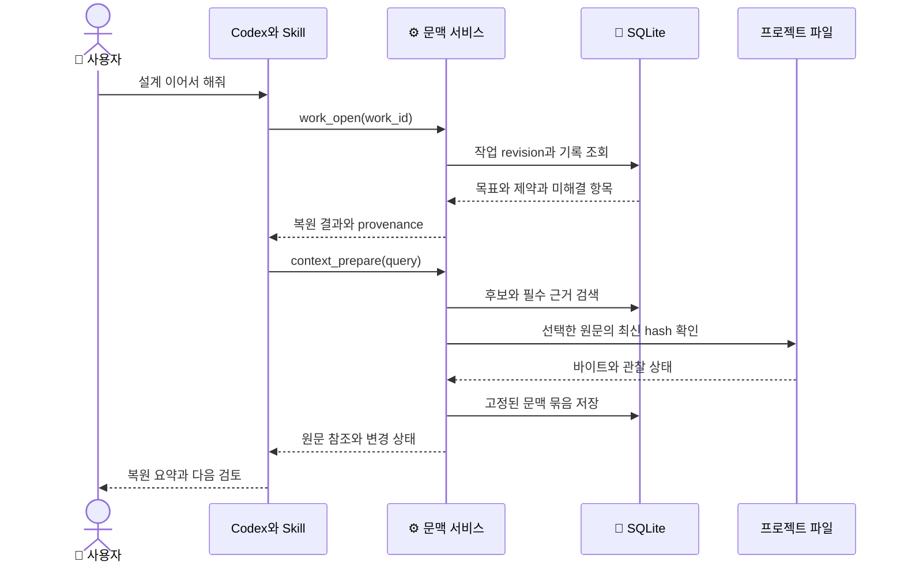

# 저장 구조와 처리 순서

이전 설계 참고 기록 · 제품 방향·범위·완료 기준은 [통합 설계 2.0](unified-design.md)으로 대체
아래의 현재·미구현·검증 상태는 작성 당시의 기록이며 최신 실행 상태와 구분

상세 설계 1.0 · [제품 상세 설계](detailed-design.md)와 [도구 계약](tool-contracts.md)의 영속 상태·동시성 설계
아래 표는 논리 스키마이며 아직 생성하지 않은 데이터베이스의 제안 구조

## 저장 위치와 프로젝트 분리

설치 설정에서 `PROJECT_ROOT`와 `DATA_ROOT`를 각각 지정
DATA_ROOT는 사용자에게 허용된 로컬 디스크의 전용 폴더이며 네트워크 공유·동기화 충돌이 있는 폴더는 기본값에서 제외
프로젝트 루트에 자동으로 DB를 작성하거나 저장소의 Git 추적 파일을 수정하지 않는 설치 방식
프로젝트별 무작위 project ID와 해당 DB 경로를 설정에 기록하고 경로 문자열의 hash만으로 정체성을 결정하지 않는 구조

제안 디렉터리 구조

```text
DATA_ROOT/
  registry.json
  projects/
    PROJECT_ID/
      state.sqlite
      state.sqlite-wal
      state.sqlite-shm
      backups/
      logs/
  profiles/
    PROFILE_ID.json
```

원문 바이트·추출 텍스트·파생 기록은 같은 DB에 저장해 첫 버전에서 DB와 외부 blob 파일 간 커밋 불일치를 피하는 선택
모델 가중치는 기존 엔진 환경에서 관리하고 프로젝트 DB와 백업에 포함하지 않는 구성
registry와 profile은 설치·설정 경로에서만 변경하고 MCP의 일반 자료 입력이 엔진 주소나 데이터 경로를 변경하지 않는 규칙
worktree가 다르면 별도 project ID를 기본으로 부여하며 경로 이동은 사용자 설정을 통해 기존 project ID에 명시적으로 재연결

## 논리 스키마

모든 테이블은 같은 project DB 안의 ID만 참조하며 foreign key 검증 활성화
본문·원문이 있는 행에는 삭제와 출처 연결에 필요한 origin 정보를 함께 저장

| 테이블 | 주요 필드 | 고유 조건·관계 |
| --- | --- | --- |
| `project_meta` | project_id, schema_version, data_revision, source_set_revision, policy_revision | DB마다 1개 |
| `works` | work_id, title, goal, scope_json, revision, status, created_at, updated_at | work_id PK |
| `events` | event_id, work_id, work_revision, kind, payload, provenance, origin_json | work_id와 work_revision 고유 |
| `decisions` | decision_id, work_id, text, status, adopted_event_id, replacement_id | event에서 현재 상태 투영 |
| `issues` | issue_id, work_id, kind, text, status, opened_event_id, resolved_event_id | 해결 근거 없는 자동 해제 금지 |
| `evidence` | evidence_id, work_id, claim, target_revision, observation_json, provenance | 관찰과 주장 분리 |
| `sources` | source_id, locator_kind, locator_key, current_revision, status, policy_json | locator_kind와 locator_key 고유 |
| `source_revisions` | revision_id, source_id, sha256, raw_bytes, decoded_text, observed_at, origin_json | source_id와 sha256 고유 |
| `chunks` | chunk_id, revision_id, start_line, end_line, byte_start, byte_end, text, neighbor_refs | revision 내 안정적인 위치 |
| `source_refs` | owner_type, owner_id, source_id, revision_id, locator_json | 파생 자료의 출처 연결 |
| `evaluations` | evaluation_id, input_hash, profile_fingerprint, status, raw_scores, decision_json | 모델 판정 기록 |
| `packets` | packet_id, work_id, work_revision, source_set_revision, body_json, status | 반환 시점 고정 |
| `packet_refs` | packet_id, source_id, revision_id | 원문 변경·삭제 영향 계산 |
| `mutations` | tool_name, mutation_id, input_hash, state, safe_result, expires_at | tool_name과 mutation_id 고유 |
| `sync_items` | mutation_id, item_index, locator_key, state, result_json | 동기화 항목별 복구 |
| `tombstones` | object_kind, object_id, deleted_at | 원문 없는 삭제 식별 정보 |

검색용 FTS5 어휘 인덱스·trigram 인덱스는 chunks에서 생성한 재구축 가능한 파생 테이블
source_refs의 다형 참조는 애플리케이션에서 검사하고 source·revision 관계는 실제 foreign key로 검증
event·현재 상태 투영·revision 증가·mutation 결과를 한 트랜잭션에 기록
event에서만 현재 투영을 만들고 독립적인 두 경로로 scope를 수정하지 않는 기준
프로세스가 모델 요청을 기다리는 동안 트랜잭션을 열어두지 않는 원칙

### revision의 의미

work revision은 해당 작업의 의도·기록이 바뀔 때 증가
source_set_revision은 자료 추가·현재 revision 변경·missing·삭제·수집 정책 변경 때 증가
data_revision은 작업·자료·정책의 도메인 변경마다 증가하고 캐시·packet만 추가할 때는 유지
하나의 원문이 바뀌면 기존 revision은 과거 기록으로 유지하고 current_revision만 새 revision으로 이동
과거 revision 읽기는 허용하되 현재성과 삭제 정책을 함께 검증
파일이 예전 바이트로 되돌아오면 같은 source의 기존 content revision을 다시 가리킬 수 있으나 source_set_revision은 증가

## 작업·결정 상태

| 대상 | 시작 상태 | 전이 | 조건 |
| --- | --- | --- | --- |
| work | `active` | `completion_reported` | 완료 보고 event 저장, 증거 커버리지 별도 |
| work | `completion_reported` | `active` | 재개 event와 이유 |
| decision | `proposed` | `adopted_reported` | 사용자 채택으로 보고된 origin 연결 |
| decision | `adopted_reported` | `superseded` | replacement 결정과 변경 origin |
| issue | `open` | `resolved_reported` | 해결 내용·근거 참조 |
| source | `available` | `missing` 또는 `excluded` | 실제 읽기 실패·정책 변경 |
| source | `missing` | `available` | 새 읽기 검증 성공 |
| packet | `valid_at_read` | `stale` 또는 `invalidated` | 참조 revision·작업·정책 변경 |

자연어 “승인됨” 문자열을 DB에서 OS 실행 권한으로 변환하는 상태는 제공하지 않는 구조
최신 사용자 요청과 충돌하는 과거 scope는 호스트가 수정 event로 갱신하고 과거 기록은 변경 이력으로 유지

## 작업 재개 시퀀스

다음 순서는 성공적으로 복원하고 자료를 확인하는 경우의 제안 호출 순서



판정 모델은 이 순서의 필수 구성에서 제외되어 모델 장애가 복원을 막지 않는 구조
관찰 가능한 파일 확인 시점 이후의 변경까지 최신이라고 보장하지 않는 시간 경계

## 문맥 준비의 상세 순서

1. 입력·작업·정책·예산을 검증하고 시작 revision 기록
2. 짧은 읽기 트랜잭션으로 필수 제약과 검색 후보의 ID 확보
3. 트랜잭션 밖에서 선택한 파일을 읽고 hash 비교
4. 변경된 원문을 항목별로 저장하고 검색 후보를 한 번 재계산
5. 여전히 바뀌는 자료는 unstable로 표시하고 관련 판정 유보
6. 한국어 프로필·입력량·엔진 상태·남은 시간을 확인해 필요한 모델 호출 수행
7. 모델 응답의 타입·라벨·분포·참조 revision을 검증
8. 작업 revision과 source_set_revision이 달라졌으면 부분 결과 또는 재요청 표시
9. 보호 항목·반대 근거·일반 근거를 예산 안에 배치
10. 반환할 packet과 source refs를 저장하고 packet ID와 함께 응답

source_set 변경의 원인이 이 요청의 원문 갱신이면 갱신 후 revision을 기준으로 다시 계산
다른 프로세스가 계속 갱신하면 무한 재시도하지 않고 partial과 영향 범위 반환
검증 후 변한 파일이나 늦은 모델 답으로 이미 반환한 packet 내용을 바꾸지 않는 기준

## 원문 수집의 커밋과 복구

동기화 요청 접수 시 mutation과 입력 목록의 hash만 먼저 기록
각 item은 실제 읽기·파싱을 트랜잭션 밖에서 수행하고 검증 후 원문·chunk·FTS·item 결과를 한 트랜잭션으로 커밋
이미 커밋한 item은 같은 mutation 재시도에서 다시 기록하지 않는 기준
프로세스 종료 후 processing 상태의 미완료 item은 원문을 다시 읽고 새 hash로 재평가
동일 실행 내 완료 항목과 나중에 재개한 항목이 같은 시점의 snapshot이라는 보장은 제공하지 않는 규칙
응답이 확정된 partial mutation은 replay 시 동일한 완료·미처리 목록을 반환하고 남은 작업은 새 mutation으로 진행

### DB 동시성

SQLite WAL과 foreign keys를 사용하고 같은 장비의 로컬 파일시스템에서 운영
네트워크 파일시스템에서 WAL 공유를 전제로 하지 않는 근거: [SQLite WAL 제약](https://sqlite.org/wal.html)
짧은 쓰기 트랜잭션에 optimistic revision 검사 적용, 잠금 대기 기본 1초
쓰기 실패 시 커밋 전인지 결과 응답만 유실됐는지를 mutation으로 조회
불명 상태에서 새 mutation ID를 만들어 같은 작업을 중복 수행하지 않는 클라이언트 규칙
OS 프로세스 종료·전원 중단·호스트 연결 종료를 포함한 복구 사례를 구현 단계에서 별도로 검증

## 캐시와 오염 방지

| 캐시 | 키 구성 | 무효화 조건 |
| --- | --- | --- |
| 추출·chunk | source hash·파서 버전·정규화 버전 | 내용·파서·삭제 정책 변경 |
| 검색 후보 | query·source_set_revision·policy_revision·검색 설정 | 자료 집합·권한·검색 방식 변경 |
| 모델 판정 | 실제 입력 hash·전체 profile fingerprint | 입력·질문·엔진·정밀도·언어·보정 변경 |
| 문맥 묶음 | work revision·source set·예산·필수 refs·프로필 | 작업·자료·예산·정책 변경 |

캐시 키의 query에는 사용자 요청을 포함하되 불필요한 원문 전체를 로그에 노출하지 않는 정책
모델에 보내지 않은 후보와 평가 세트의 정답을 판정 입력에 섞지 않는 기준
한국어 번역을 도입하면 번역 모델·용어집·원문 대응 버전을 추가하며 변환된 자료를 독립 출처로 계산하지 않는 규칙
캐시 적중 시에도 삭제·접근 정책과 현재 revision을 다시 확인

## 삭제와 복구

### 논리 삭제와 반환 차단

data_forget에서 expected_data_revision을 확인하고 source 또는 work의 파생 참조를 조회
대상 본문·chunk·FTS·판정·packet과 대상에 연결된 event의 인용 본문을 같은 DB 트랜잭션에서 삭제 또는 가림
원문 없는 tombstone·mutation의 입력 hash·삭제 개수만 남기고 이전 replay 결과의 본문도 제거
다른 source가 가진 독립적인 같은 문장이나 출처 연결 없이 사용자가 새로 붙여넣은 텍스트까지 자동 탐지·삭제한다고 보장하지 않는 범위
원본 프로젝트 파일과 외부 URL의 원본은 변경하지 않는 구조

### 물리 보존과 백업

DB 삭제 이후에도 WAL·백업·SSD 내부에 바이트가 남을 수 있으므로 논리 삭제 완료와 물리 소거를 구분
일반 운영에서 secure_delete와 checkpoint를 검토하되 장비 수준의 안전 소거 보증으로 표시하지 않는 기준
백업은 기본 비활성, 사용자가 설정한 로컬 대상에만 명시적으로 생성
일관된 백업은 SQLite backup API를 사용하고 WAL 파일을 무시한 단일 DB 복사로 대체하지 않는 구현 조건
백업 생성 시 schema_version·내용 hash·생성 시각 기록
복구는 기존 DB를 덮어쓰기 전에 새 경로에서 무결성·schema·프로젝트 연결을 검증하고 삭제 tombstone과 충돌하는 복원을 안내
이미 삭제된 자료가 포함된 과거 백업을 자동 복원하지 않는 정책

### 스키마 변경

단일 migration 소유권 잠금을 얻고 DB 백업을 확보한 뒤 트랜잭션 가능한 migration 수행
새 버전의 migration이 실패하면 기존 DB로 복귀하고 구형 프로세스가 새 schema에 쓰지 못하도록 시작 단계에서 차단
파괴적인 schema 변경이나 진단되지 않은 DB 손상에서 자동 새 DB 생성으로 과거 기억을 잃지 않는 동작
재구축 가능한 FTS 손상은 원문에서 재색인하고 원문 DB 손상은 별도 복구가 필요한 오류로 표시

## 구현 검토에서 확인할 사항

동일 mutation 동시 요청, 응답 직전 프로세스 종료, 파일 변경 중 읽기, work revision 충돌, 삭제 뒤 replay를 우선 검증
Laya 중복 적재 잠금과 소유자 종료, 모델 입력 잘림, 한국어 검색의 짧은 단어 누락을 별도 확인
이 문서의 상태·복구는 설계 계약이며 실제 DB·프로세스·엔진 테스트 완료를 뜻하지 않는 기준
